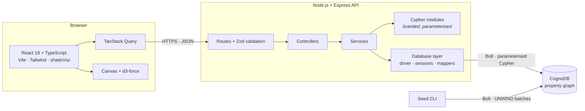
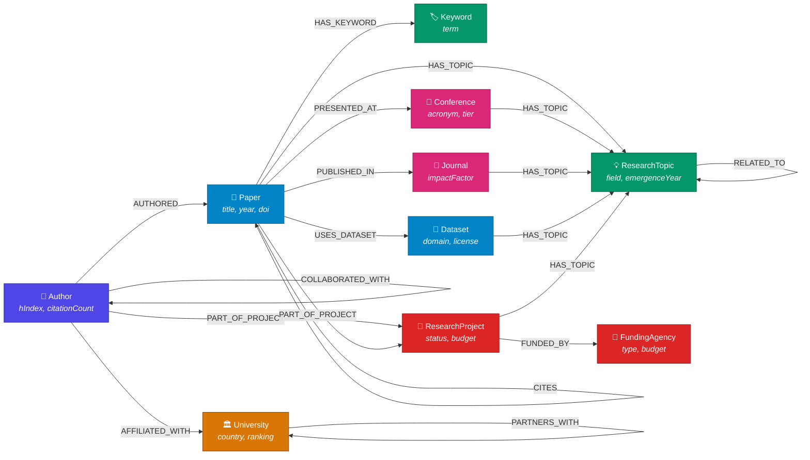

<div align="center">

# Research Nexus

**AI-Powered Research Collaboration & Knowledge Discovery Platform**

Map the research ecosystem as a connected graph — collaborators, citations,
topics, institutions and funding — and traverse it.

[](.github/workflows/ci.yml)
[](https://www.typescriptlang.org/)
[](https://nodejs.org/)
[](LICENSE)

[Overview](#overview) · [Why a graph database](#why-a-graph-database) ·
[Data model](#graph-data-model) · [Quick start](#quick-start) ·
[API](#api-documentation) · [Deployment](#deployment)

</div>

---

## Overview

Research Nexus is a full-stack application built on a property graph. It models
authors, papers, research topics, keywords, universities, conferences, journals,
datasets, funding agencies and research projects as nodes, connected by thirteen
relationship types — and then makes those connections the product.

The seeded dataset holds **1,420 nodes** and roughly **16,000 relationships**.
Every panel in the UI is a live Cypher traversal against CognoDB over the Bolt
protocol. There is no reporting table, no materialised view and no nightly
aggregation job anywhere in the system.

**What it does**

- 🔍 **Global search** across all ten entity types in a single round trip
- 🕸 **Interactive graph explorer** — canvas-rendered force simulation, click to
  inspect, double-click to expand a neighbourhood
- 🛣 **Shortest path discovery** between any two researchers, with every equally
  short route
- 🤝 **Hidden collaborator detection** — people two hops away working on your
  topics whom you have never co-authored with
- 📄 **Explainable paper recommendations** blending shared topics, keywords,
  co-citation and bibliographic coupling
- 🎓 **Expert discovery** ranked on output, impact *and* topic focus
- 📈 **Trending topics** computed by comparing publication windows
- 🔗 **Citation chain exploration** in both directions across multiple hops
- 🏛 **Institutional and funder similarity** by Jaccard topic-profile overlap
- 🌐 **Cross-domain collaboration analysis**
- 📊 **Analytics dashboard** computed entirely at query time

---

## Problem Statement

Researchers need to find things that are not stored anywhere as facts:

- Who should I be collaborating with, and who do we both know?
- Which papers are relevant to mine, beyond the ones that cite it directly?
- Who are the genuine experts on this topic — not just the most prolific people?
- How is my work connected to a researcher on the other side of the world?
- Which funders support research like mine?
- Which fields are actually producing joint work, and which only claim to?

None of these are lookups. Every one is a question about **paths and
neighbourhoods** in a densely connected network — and the answers are not in any
row, they are in the shape of the connections.

---

## Why a Graph Database?

A relational database retrieves papers, authors and publications perfectly well.
It struggles the moment the question is about *relationships between
relationships*.

### The same question, both ways

**"Find researchers within three collaboration hops who work on my topics but
have never co-authored with me."**

<table>
<tr><th width="50%">PostgreSQL</th><th width="50%">Cypher</th></tr>
<tr valign="top">
<td>

```sql
WITH RECURSIVE collab AS (
  SELECT a2.author_id AS peer, 1 AS depth
  FROM paper_authors a1
  JOIN paper_authors a2 USING (paper_id)
  WHERE a1.author_id = $1
    AND a2.author_id <> $1
  UNION
  SELECT a2.author_id, c.depth + 1
  FROM collab c
  JOIN paper_authors a1
    ON a1.author_id = c.peer
  JOIN paper_authors a2
    ON a2.paper_id = a1.paper_id
  WHERE c.depth < 3
    AND a2.author_id <> $1
),
my_topics AS (
  SELECT DISTINCT pt.topic_id
  FROM paper_authors pa
  JOIN paper_topics pt USING (paper_id)
  WHERE pa.author_id = $1
),
direct AS (
  SELECT DISTINCT a2.author_id
  FROM paper_authors a1
  JOIN paper_authors a2 USING (paper_id)
  WHERE a1.author_id = $1
)
SELECT c.peer,
       MIN(c.depth) AS distance,
       COUNT(DISTINCT pt.topic_id) AS shared
FROM collab c
JOIN paper_authors pa
  ON pa.author_id = c.peer
JOIN paper_topics pt USING (paper_id)
WHERE pt.topic_id IN (SELECT topic_id FROM my_topics)
  AND c.peer NOT IN (SELECT author_id FROM direct)
GROUP BY c.peer
ORDER BY shared DESC, distance ASC;
```

**~35 lines.** A recursive CTE with a cycle guard, two supporting CTEs, an
anti-join, and an aggregate over a four-way join. Every level of depth is another
pass over the join table.

</td>
<td>

```cypher
MATCH (me:Author { id: $authorId })

OPTIONAL MATCH (me)-[:COLLABORATED_WITH]-(direct)
WITH me, collect(DISTINCT direct.id) AS directIds

MATCH path = (me)-[:COLLABORATED_WITH*1..3]-(peer:Author)
WHERE peer.id <> me.id
  AND NOT peer.id IN directIds

MATCH (me)-[:AUTHORED]->(:Paper)
      -[:HAS_TOPIC]->(topic)
      <-[:HAS_TOPIC]-(:Paper)
      <-[:AUTHORED]-(peer)

RETURN peer,
       min(length(path)) AS distance,
       count(DISTINCT topic) AS shared
ORDER BY shared DESC, distance ASC
```

**~14 lines,** and it reads like the question. `*1..3` is the traversal depth.
The topic overlap is a path pattern, drawn rather than joined.

The engine walks relationships from an index-seeded node. It never scans a join
table, because there is no join table — a relationship *is* a pointer.

</td>
</tr>
</table>

### Where the difference actually comes from

| Aspect | Relational | Graph |
| ------ | ---------- | ----- |
| Relationships | Rows in a join table, found by index lookup | First-class, traversed by pointer |
| Multi-hop cost | One join per hop; degrades with table size | Local to the visited neighbourhood |
| Variable depth | Recursive CTE with a cycle guard | `*1..n` |
| Shortest path | Materialise every partial path, then prune | `shortestPath()` — bidirectional BFS |
| Adding a relationship type | Migration: new table, new indexes | Add edges; existing queries unaffected |
| Query readability | Intent buried in join mechanics | Pattern mirrors the question |

The decisive property is **index-free adjacency**. In a relational schema,
following a relationship means looking it up. In a property graph, a node holds
direct references to its relationships, so traversal cost depends on the size of
the neighbourhood you actually visit — not on how much data exists elsewhere. A
three-hop query costs roughly the same on a graph of ten thousand nodes as on ten
million.

### Where relational would still be the right call

Being fair about this matters. If the workload were "aggregate citation counts
per journal per quarter" or "invoice reconciliation across a fixed schema", a
relational database would be the better tool — set operations over uniform rows
are what it is built for. Research Nexus is a graph project because its questions
are overwhelmingly about connection, not because graphs are universally better.

📖 **Full query-by-query breakdown:** [`docs/graph-queries.md`](docs/graph-queries.md)
📖 **Query catalogue — 23 production queries:** [`docs/query-catalogue.md`](docs/query-catalogue.md)

---

## Architecture



📖 **Layer boundaries, resilience model, rendering strategy:**
[`docs/architecture.md`](docs/architecture.md)

---

## Graph Data Model



### Nodes

| Label             | Count | Key properties                                              |
| ----------------- | ----: | ----------------------------------------------------------- |
| `Author`          |   300 | `name`, `title`, `orcid`, `hIndex`, `citationCount`, `primaryField` |
| `Paper`           |   600 | `title`, `abstract`, `year`, `doi`, `citationCount`         |
| `University`      |    50 | `name`, `country`, `city`, `type`, `ranking`                |
| `ResearchTopic`   |   100 | `name`, `field`, `emergenceYear`, `paperCount`              |
| `Keyword`         |   150 | `term`, `paperCount`                                        |
| `Conference`      |    40 | `name`, `acronym`, `field`, `tier`                          |
| `Journal`         |    30 | `name`, `publisher`, `issn`, `impactFactor`                 |
| `Dataset`         |    40 | `name`, `domain`, `license`, `sizeGb`                       |
| `FundingAgency`   |    30 | `name`, `country`, `type`, `annualBudgetUsd`                |
| `ResearchProject` |    80 | `title`, `status`, `startYear`, `endYear`, `budgetUsd`      |

### Relationships

| Type                | Pattern                                       | Properties                              |
| ------------------- | --------------------------------------------- | --------------------------------------- |
| `AUTHORED`          | `(Author)→(Paper)`                            | `position`, `isCorresponding`           |
| `CITES`             | `(Paper)→(Paper)`                             | `year`                                  |
| `AFFILIATED_WITH`   | `(Author)→(University)`                       | `since`, `role`, `isPrimary`            |
| `HAS_TOPIC`         | `(Paper\|Conference\|Journal\|Dataset\|Project)→(Topic)` | `relevance`                  |
| `HAS_KEYWORD`       | `(Paper)→(Keyword)`                           | —                                       |
| `PUBLISHED_IN`      | `(Paper)→(Journal)`                           | `year`, `volume`, `issue`               |
| `PRESENTED_AT`      | `(Paper)→(Conference)`                        | `year`, `track`                         |
| `USES_DATASET`      | `(Paper)→(Dataset)`                           | `usageType`                             |
| `FUNDED_BY`         | `(Project)→(FundingAgency)`                   | `amountUsd`, `grantNumber`, `startYear` |
| `COLLABORATED_WITH` | `(Author)↔(Author)` *derived*                 | `paperCount`, `firstYear`, `lastYear`   |
| `RELATED_TO`        | `(Topic)↔(Topic)`                             | `strength`                              |
| `PART_OF_PROJECT`   | `(Paper\|Author)→(Project)`                   | `role`                                  |
| `PARTNERS_WITH`     | `(University)↔(University)`                   | `since`, `focus`                        |

`COLLABORATED_WITH` is **derived** from `AUTHORED` after loading — a deliberate
denormalisation that turns the most common traversal in the product from a
four-hop pattern into a one-hop pattern.

### Constraints and indexes

Applied by `npm run db:schema` from [`database/schema/`](database/schema/).

- **Uniqueness** on every `id`, plus `Keyword.term`, `Paper.doi`, `Author.orcid`.
  These make the seed idempotent, and — because each is index-backed — turn every
  `MATCH (n:Label {id: $id})` into a single index seek.
- **Search** indexes on `searchText` for all ten labels. Every searchable node
  carries a lowercased blob of its readable fields, so global search is a plain
  `CONTAINS` predicate rather than a vendor-specific full-text call.
- **Ranking** indexes on `hIndex`, `citationCount`, `ranking`, `impactFactor`,
  `paperCount`.
- **Range** indexes on `year`, `startYear`, `field`, `country`, `tier`.
- **Composite** indexes on `Paper(year, citationCount)` and
  `ResearchTopic(field, paperCount)`.

📖 **Full model specification:** [`docs/graph-model.md`](docs/graph-model.md)
📖 **Design spec — schema, journeys, traversals:** [`docs/graph-design.md`](docs/graph-design.md)

---

## Tech Stack

| Layer        | Technology                                                             |
| ------------ | ---------------------------------------------------------------------- |
| **Frontend** | React 18 · TypeScript · Vite · TailwindCSS · shadcn/ui · React Router · TanStack Query · Framer Motion · Recharts · d3-force |
| **Backend**  | Node.js · Express · TypeScript                                          |
| **Database** | CognoDB via the official `neo4j-driver` (Bolt · OpenCypher)             |
| **Validation** | Zod                                                                  |
| **Config**   | dotenv                                                                  |
| **Testing**  | Vitest · Supertest · Testing Library                                    |
| **Quality**  | ESLint (flat config, type-aware) · Prettier                             |

---

## Project Structure

```
research-nexus/
├── client/                      React frontend
│   └── src/
│       ├── components/
│       │   ├── ui/              shadcn/ui primitives
│       │   ├── common/          PageHeader, StatCard, EmptyState, ErrorState…
│       │   ├── entities/        AuthorCard, PaperCard, TopicCard…
│       │   ├── graph/           GraphCanvas, useForceLayout, NodeInspector
│       │   └── layout/          AppShell, sidebar, command-palette search
│       ├── hooks/               one hook per endpoint
│       ├── lib/                 API client, query client, formatting
│       ├── pages/               one file per route
│       └── types/api.ts         mirrored contract types
│
├── server/                      Express API
│   ├── src/
│   │   ├── config/              Zod-validated environment
│   │   ├── cypher/              parameterised query modules
│   │   ├── db/                  driver, sessions, serialization, mappers
│   │   ├── services/            query params in, domain objects out
│   │   ├── controllers/         HTTP handlers
│   │   ├── routes/              API surface
│   │   ├── middleware/          validation, errors, rate limit, logging
│   │   ├── validators/          Zod request schemas
│   │   └── utils/               logger, errors, pagination, envelope
│   └── tests/                   unit + integration
│
├── seed/                        Deterministic data generator CLI
│   └── src/
│       ├── data/                vocabularies
│       ├── generators/          node and relationship generation
│       ├── writer.ts            batched UNWIND writer
│       └── derive.ts            post-load Cypher aggregations
│
├── database/schema/             constraints and indexes (.cypher)
├── docs/                        architecture, model, queries, API
├── screenshots/                 UI captures
└── .github/workflows/           CI
```

📖 **Full structure, layer responsibilities, naming conventions:** [`docs/project-structure.md`](docs/project-structure.md)

---

## Quick Start

### Prerequisites

- Node.js **20.11+**
- A running CognoDB instance (or any Bolt-compatible OpenCypher engine)

### 1. Install

```bash
git clone https://github.com/research-nexus/research-nexus.git
cd research-nexus
npm install
```

### 2. Configure

```bash
cp .env.example .env
```

One `.env` at the repository root drives the server, the seed CLI and the Vite
dev proxy.

### 3. Start CognoDB

```bash
docker compose up -d cognodb
```

<details>
<summary>Using a different CognoDB deployment</summary>

Point `COGNODB_URI` at your instance. Any Bolt endpoint works:

```ini
# Local
COGNODB_URI=bolt://localhost:7687

# Managed / TLS
COGNODB_URI=neo4j+s://your-instance.example.com:7687
```

The `+s` and `+ssc` schemes encode their TLS policy, so leave
`COGNODB_ENCRYPTED=false` when using them — the driver rejects being told twice.

</details>

### 4. Apply schema and seed

```bash
npm run db:schema     # constraints and indexes
npm run db:seed       # ~1,420 nodes, ~16,000 relationships
```

Expected output:

```
› Generating graph with seed "research-nexus-2024"
✓ Generated 1,420 nodes and 14,048 relationships in 118ms
› Writing nodes
  University          50
  ResearchTopic      100
  …
› Deriving graph metrics
  [1/10] COLLABORATED_WITH edges from shared authorship
  …
✓ Seed complete in 12.4s
```

### 5. Run

```bash
npm run dev
```

| Service  | URL                              |
| -------- | -------------------------------- |
| Frontend | http://localhost:5173            |
| API      | http://localhost:4000/api/v1     |
| Health   | http://localhost:4000/api/v1/health |

---

## Environment Variables

<details open>
<summary><b>Database</b></summary>

| Variable                           | Default                 | Description                              |
| ---------------------------------- | ----------------------- | ---------------------------------------- |
| `COGNODB_URI`                      | `bolt://localhost:7687` | Bolt connection URI                      |
| `COGNODB_USERNAME`                 | `neo4j`                 |                                          |
| `COGNODB_PASSWORD`                 | `research-nexus`        |                                          |
| `COGNODB_DATABASE`                 | *(empty)*               | Leave empty for the server default       |
| `COGNODB_MAX_POOL_SIZE`            | `50`                    | Connection pool size                     |
| `COGNODB_CONNECTION_TIMEOUT_MS`    | `15000`                 |                                          |
| `COGNODB_MAX_TRANSACTION_RETRY_MS` | `15000`                 | Managed-transaction retry budget         |
| `COGNODB_ENCRYPTED`                | `false`                 | Only for plain `bolt://` / `neo4j://`    |

</details>

<details>
<summary><b>Server</b></summary>

| Variable                  | Default                 | Description                          |
| ------------------------- | ----------------------- | ------------------------------------ |
| `NODE_ENV`                | `development`           |                                      |
| `PORT`                    | `4000`                  |                                      |
| `HOST`                    | `0.0.0.0`               |                                      |
| `API_PREFIX`              | `/api/v1`               |                                      |
| `LOG_LEVEL`               | `info`                  | `debug` \| `info` \| `warn` \| `error` \| `silent` |
| `CORS_ORIGINS`            | `http://localhost:5173` | Comma-separated allow-list           |
| `RATE_LIMIT_WINDOW_MS`    | `60000`                 |                                      |
| `RATE_LIMIT_MAX_REQUESTS` | `300`                   |                                      |
| `MAX_PAGE_SIZE`           | `100`                   | Upper bound on every `limit`         |
| `MAX_GRAPH_NODES`         | `400`                   | Upper bound on graph expansions      |

</details>

<details>
<summary><b>Seed &amp; client</b></summary>

| Variable             | Default                | Description                                       |
| -------------------- | ---------------------- | ------------------------------------------------- |
| `SEED_RANDOM_SEED`   | `research-nexus-2024`  | Same value ⇒ byte-identical graph                 |
| `SEED_BATCH_SIZE`    | `500`                  | Rows per `UNWIND` batch                           |
| `VITE_API_BASE_URL`  | `/api/v1`              | Leave relative in dev; the Vite proxy handles it  |

</details>

Configuration is validated by Zod at boot. A missing or malformed value fails
immediately with a precise message rather than surfacing as a confusing runtime
error later.

---

## Commands

| Command               | Description                                       |
| --------------------- | ------------------------------------------------- |
| `npm run dev`         | Server and client together                        |
| `npm run dev:server`  | API only, watch mode                              |
| `npm run dev:client`  | Frontend only                                     |
| `npm run build`       | Build both packages                               |
| `npm start`           | Run the built API                                 |
| `npm test`            | All test suites                                   |
| `npm run typecheck`   | Typecheck all workspaces                          |
| `npm run lint`        | ESLint across the repository                      |
| `npm run format`      | Prettier                                          |
| `npm run db:schema`   | Apply constraints and indexes                     |
| `npm run db:seed`     | Generate and load the graph                       |
| `npm run db:reset`    | Delete every node and relationship                |
| `npm run stats --workspace seed` | Print node and relationship counts      |

Add `-- --with-fulltext` to `db:schema` to additionally apply the optional
full-text indexes. The application never requires them.

---

## API Documentation

Base URL `/api/v1`. All endpoints are `GET`; the API is read-only.

<details open>
<summary><b>Core resources</b></summary>

| Endpoint                     | Description                                    |
| ---------------------------- | ---------------------------------------------- |
| `GET /authors`               | `search`, `minHIndex`, `sort`, `offset`, `limit` |
| `GET /authors/:id`           | Full profile in one request                    |
| `GET /papers`                | `search`, `fromYear`, `toYear`, `minCitations`, `sort` |
| `GET /papers/:id`            | Abstract, keywords, datasets, both citation directions |
| `GET /universities`          | `search`, `country`, `sort`                    |
| `GET /universities/:id`      | Researchers, strengths, partners               |
| `GET /topics`                | `search`, `field`, `sort`                      |
| `GET /topics/:id`            | Detail, related topics, experts, yearly output |
| `GET /conferences`           | `search`, `field`, `tier`                      |
| `GET /journals`              | `search`, `field`, `minImpactFactor`           |
| `GET /funding/agencies`      | `search`, `country`, `type`, `sort`            |
| `GET /funding/projects`      | `search`, `status`, `sort`                     |
| `GET /datasets`              | `search`, `domain`, `sort`                     |
| `GET /keywords`              | `search`                                       |

</details>

<details open>
<summary><b>Graph-native endpoints</b></summary>

| Endpoint                                 | Capability                                  |
| ---------------------------------------- | ------------------------------------------- |
| `GET /authors/:id/collaborators`         | Multi-hop collaboration network             |
| `GET /authors/:id/hidden-collaborators`  | Second-degree peers on shared topics        |
| `GET /authors/:id/recommendations`       | Personalised reading list                   |
| `GET /papers/:id/similar`                | Four-signal similarity, explainable         |
| `GET /papers/:id/citation-chains`        | Multi-hop citation lineage, both directions |
| `GET /papers/:id/citation-tree`          | Citation tree, flattened with parent links  |
| `GET /papers/:id/influential-citations`  | Lineage ranked by accumulated influence     |
| `GET /topics/:id/experts`                | Expert ranking with focus ratio             |
| `GET /topics/:id/related`                | Direct and inferred topic relationships     |
| `GET /topics/:id/similar`                | Similarity through the shared keyword vocabulary |
| `GET /topics/trending`                   | Windowed growth analysis                    |
| `GET /universities/:id/similar`          | Jaccard topic-profile overlap               |
| `GET /funding/agencies/:id/similar`      | Funders backing the same research           |
| `GET /discovery/cross-domain`            | Field pairs producing joint work            |
| `GET /collaboration/researchers`         | Researchers ranked by collaboration reach   |
| `GET /citations/path`                    | Shortest route along `CITES` edges          |
| `GET /graph/shortest-path`               | `shortestPath` between any two entities     |
| `GET /graph/expand`                      | Bounded neighbourhood expansion             |
| `GET /graph/sample`                      | Explorer landing subgraph                   |
| `GET /graph/neighbourhood/:id`           | Everything within N hops, by distance       |
| `GET /search`                            | All ten labels in one round trip            |
| `GET /analytics/summary`                 | Full analytics payload                      |
| `GET /analytics/popular-authors`         | Citation-impact leaderboard                 |
| `GET /analytics/most-cited-papers`       | Ranked by counted `CITES` edges, not a stored column |
| `GET /analytics/connected-keywords`      | Keywords by co-occurrence degree            |
| `GET /analytics/funded-areas`            | Grant money traced to research fields       |
| `GET /analytics/collaborative-institutions` | Institutions by distinct partner count   |
| `GET /health`, `/health/ready`           | Liveness and readiness probes               |

Flat aliases exist for clients that prefer a verb-first shape:
`/recommendations/papers/:id`, `/recommendations/authors/:id`,
`/collaboration/path`, `/collaboration/researchers/:id`, `/citations/:id`,
`/analytics/dashboard`, `/analytics/trending-topics`, `/graph`,
`/graph/author/:id` and `/graph/paper/:id`. See [docs/api.md](docs/api.md).

</details>

**Response envelope**

```jsonc
{
  "success": true,
  "data": [ /* … */ ],
  "meta": { "offset": 0, "limit": 20, "count": 20, "total": 300, "hasMore": true }
}
```

**Error envelope** — the client switches on `code`, never on message text:

```jsonc
{
  "success": false,
  "error": { "code": "DATABASE_UNAVAILABLE", "message": "CognoDB is temporarily unreachable." },
  "requestId": "0f2c1a9e-…"
}
```

📖 **Every endpoint, parameter and payload:** [`docs/api.md`](docs/api.md)

---

## Security

- **Injection is structurally impossible.** A branded `CypherStatement` type
  means `runRead`/`runWrite` accept only statements produced by the `cypher`
  tagged template, which refuses interpolation. A `string` — and therefore
  anything built from user input — does not compile.
- **Every request is validated** by Zod before reaching a controller. Numeric
  parameters are clamped server-side, so `limit=100000` is a 422 rather than a
  full graph scan.
- **Helmet** security headers, strict CORS allow-list, fixed-window rate limiting.
- **5xx details never reach the browser** in production; the full error, with its
  cause chain, is logged against a request id the user can quote.
- **Credentials are redacted** from every reported connection URI.

---

## Testing

```bash
npm test                          # everything
npm test --workspace server       # API and Cypher invariants
npm test --workspace client       # components and API client
npm test --workspace seed         # generator properties
```

Focused runs:

```bash
npm run test:unit          # server unit tests, no database
npm run test:integration   # server integration tests
npm run test:perf          # latency smoke tests, needs a database
npm run verify             # typecheck + lint + build + test
```

| Suite | Needs a database | Catches |
| ----- | :--------------: | ------- |
| Server unit | No | Logic, mapping, validation, connection state machine |
| Cypher drift guards | No | A query naming a label or relationship the schema lacks |
| Route coverage | No | Mis-wired routes, unhandled exceptions, envelope drift |
| Failure scenarios | No | Outages, bad input, empty results, error leakage |
| Graph queries | **Yes** | **Cypher syntax and semantics** — nothing else can |
| Performance smoke | Yes | A query plan that collapsed into a scan |
| Client | No | Components, geometry, layouts, API client |
| Seed generator | No | Generator invariants and referential integrity |

The Cypher suite iterates **every** exported statement and asserts the project's
invariants across all of them: no interpolation, well-formed parameter names,
balanced delimiters, no unbounded traversals, no hard-coded page sizes.

The route-coverage guard reads the route table out of the Express router at
runtime, so a new endpoint is covered automatically — and fails the build until
it responds sensibly.

**Static validation is not sufficient for Cypher, and this repository has the
scar to prove it.** Seven queries shipped with `WITH … WHERE … ORDER BY`, which
Cypher rejects outright because `ORDER BY` binds to the projection *before*
`WHERE`. They broke ten endpoints and no static check could see them — they are
valid template strings naming only real labels. Only execution finds that class
of bug, which is why the live-database suite matters more than its test count
suggests.

📖 **Layers, utilities, failure scenarios, writing new tests:**
[`docs/testing.md`](docs/testing.md)

---

## Deployment

The frontend and API deploy separately. A static host serves the client better,
and it keeps the free API instance from spending its cycles on asset delivery.

### API → Render

1. Push to GitHub.
2. Render → **New → Blueprint**, point it at the repository. It reads
   [`render.yaml`](render.yaml).
3. Set the secrets marked `sync: false`: `COGNODB_URI`, `COGNODB_USERNAME`,
   `COGNODB_PASSWORD`, `COGNODB_DATABASE`, and `CORS_ORIGINS` (the deployed
   frontend origin).

The health check targets `/api/v1/health` — the **liveness** probe, deliberately
not readiness, so a brief database outage does not trigger a restart loop.

### Frontend → Vercel

1. Import the repository. [`vercel.json`](vercel.json) supplies the build.
2. Set `VITE_API_BASE_URL` to `https://<your-api>.onrender.com/api/v1`.
3. Add that Vercel origin to `CORS_ORIGINS` on the API.

### Database

Any managed Bolt-compatible instance works. Once it is reachable:

```bash
COGNODB_URI=neo4j+s://<host>:7687 \
COGNODB_PASSWORD=<password> \
npm run db:schema && npm run db:seed
```

### Docker

```bash
docker compose up -d      # database + API
docker build -t research-nexus-api .
```

The image is multi-stage: the build layer keeps TypeScript, the runtime layer
installs production dependencies only and runs unprivileged.

> **Note on the live demo.** The deployment configuration in this repository is
> complete and ready to apply, but the hosted URLs are not filled in — publishing
> to third-party accounts requires credentials that belong to whoever runs it.
> Following the three steps above produces a working deployment; substitute your
> own URLs into this section afterwards.

📖 **Step-by-step runbook, verification checklist, environment reference:**
[`docs/deployment.md`](docs/deployment.md)

---

## Troubleshooting

**`npm run dev` starts but every panel says "Cannot reach the API".**
The API is not running or is on a different port. Start it with
`npm run dev:server` and confirm `curl localhost:4000/api/v1/health` answers.

**Every panel shows "The graph database is unavailable".**
The API is up, CognoDB is not. Check `COGNODB_URI`, `COGNODB_USERNAME` and
`COGNODB_PASSWORD` in `.env`, then `curl localhost:4000/api/v1/health/ready` for
the reported reason. Managed instances need `bolt+s://`, not `bolt://` — a plain
scheme against a TLS host fails the handshake with a confusing socket error.

**Pages load but everything is empty, with no error.**
The graph was never seeded, or was seeded into a different database than the API
reads. Run `npm run db:validate` against the same URI the API uses.

**`ECONNRESET` or "socket disconnected before secure TLS connection".**
Free-tier CognoDB rate-limits at the *connection* level, so a burst of
traversals gets its handshakes reset. Wait a few minutes for the limit to clear.
The API recovers on its own; the test suite paces itself to stay inside the
allowance.

**Tests report "28 skipped" for the graph-query suite.**
That is the expected state with no database. To run them, seed first:
`npm run db:schema && npm run db:seed && npm run test:integration`.

**`npm run typecheck --workspace server` fails with "No workspaces found".**
Run it from the repository root, not from inside `server/`.

**A request hangs instead of failing.**
Should not happen — the client aborts after 20 seconds and the API returns 503
when the database is known to be down. If it does, check that
`COGNODB_CONNECTION_TIMEOUT_MS` has not been raised to something unreasonable.

**Port 4000 or 5173 already in use.**
Set `PORT` in `.env` for the API; pass `--port` to Vite for the client.

---

## Screenshots

Captures live in [`screenshots/`](screenshots/), with a capture guide and the
full required-shot list in [`screenshots/README.md`](screenshots/README.md).
A **2–3 minute demo script** covering every screen is in
[`docs/demo-script.md`](docs/demo-script.md).

| View | Route | What it shows |
| ---- | ----- | ------------- |
| Dashboard | `/` | Graph census, trending topics, top researchers and papers |
| Graph explorer | `/graph` | Canvas force simulation with node inspector |
| Path finder | `/paths` | Shortest collaboration route, drawn and narrated |
| Author profile | `/authors/:id` | Publications, collaborators, hidden collaborators |
| Paper detail | `/papers/:id` | Similar papers with score breakdowns, citation chains |
| Topic detail | `/topics/:id` | Experts, trend chart, related topics |
| Collaboration | `/collaboration` | Multi-hop network and cross-domain analysis |
| Analytics | `/analytics` | Relationship census, collaboration health |

---

## Roadmap

The full twelve-phase development roadmap — objectives, tasks, deliverables,
commit milestones and current status per phase — is in
[`docs/roadmap.md`](docs/roadmap.md).

| Phase | Status | | Phase | Status |
|---|:--:|---|---|:--:|
| 0 Planning | ✅ | | 6 Frontend | ✅ |
| 1 Environment | ✅ | | 7 Graph visualisation | ✅ |
| 2 Graph schema | ✅ | | 8 UI/UX | ✅ |
| 3 Seed data | ✅ | | 9 Testing | ✅ |
| 4 Backend | ✅ | | 10 Deployment | ✅ |
| 5 Graph queries | ✅ | | 11 Documentation | ✅ |

---

## Future Improvements

**Graph algorithms.** Louvain community detection to label research clusters,
PageRank for author influence, node2vec embeddings for similarity that
generalises beyond shared topics.

**Temporal traversals.** Relationships already carry years; exposing "the
collaboration graph as it stood in 2019" would make research trajectories
visible.

**Real data.** Ingestion from OpenAlex, Semantic Scholar and Crossref, with
author disambiguation — the hard part, and a graph problem in its own right.

**Write path.** The API is read-only by design. Adding curation — correcting an
affiliation, merging duplicate authors — needs an auth layer and an audit trail.

**Query cost budgets.** Traversals are bounded by depth and node count today;
the next step is a time budget with partial results rather than a hard timeout.

**Saved explorations.** Let a user bookmark a path or a subgraph and share it as
a URL.

---

## License

MIT — see [LICENSE](LICENSE).
