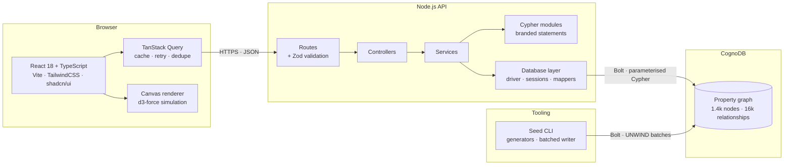
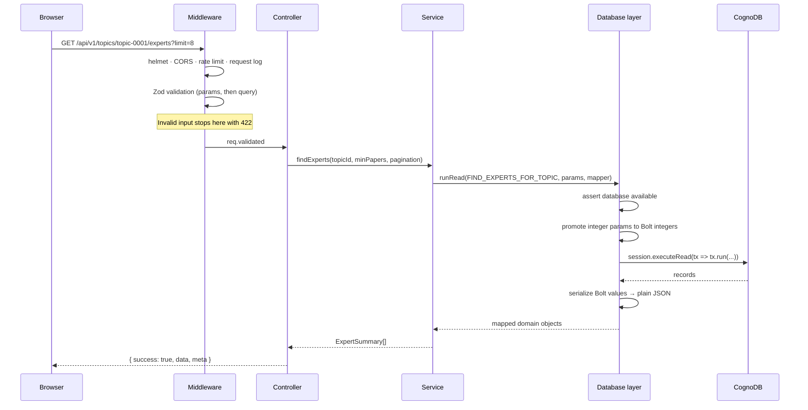
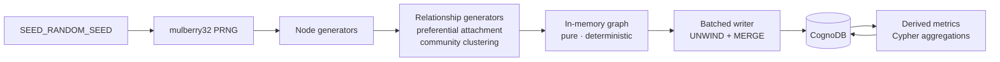

# Architecture

How Research Nexus is put together, and why each boundary sits where it does.

---

## System overview



---

## Request lifecycle

A single request, end to end:



Each boundary has exactly one job, and nothing crosses it that should not:

| Layer          | Responsibility                                          | Never does                      |
| -------------- | ------------------------------------------------------- | ------------------------------- |
| Routes         | URL shape, attach validation                             | Business logic                  |
| Middleware     | Cross-cutting concerns, schema validation                | Know about entities             |
| Controllers    | Read validated input, call a service, send the envelope  | Build queries, branch on DB state |
| Services       | Request → query parameters, records → domain objects     | Touch Express types             |
| Cypher modules | Declare parameterised statements                         | Contain any runtime value       |
| Database layer | Driver lifecycle, transactions, value conversion, error mapping | Know about domain concepts |

That separation is what makes the services directly unit-testable: they take
plain arguments and return plain objects.

---

## The rule that shapes the backend

**No query text is ever built by concatenation.** This is enforced by the type
system, not by convention.

```ts
export type CypherStatement = string & { readonly __cypher: unique symbol };

export function cypher(strings: TemplateStringsArray, ...values: unknown[]): CypherStatement {
  if (values.length > 0) {
    throw new Error(
      'Cypher templates must not interpolate values. Pass them as query parameters instead.',
    );
  }
  return (strings.raw[0] ?? '').trim() as CypherStatement;
}
```

`runRead` and `runWrite` accept only `CypherStatement`. A plain `string` — and
therefore anything assembled from user input — is rejected by the compiler, and
interpolation throws at runtime as a second line of defence.

Two consequences follow, and they are the reason the rule exists:

- **Injection is structurally impossible.** There is no code path that can put a
  request value into query text.
- **The plan cache stays small.** Optional filters are `($param IS NULL OR …)`
  and caller-chosen sorts are `CASE $sort WHEN …`, so one statement serves every
  filter combination instead of generating a new plan per permutation.

Labels and relationship types genuinely cannot be parameterised in Cypher. They
appear in exactly one place — the seed writer — where they are validated against
a strict pattern and never originate from user input.

---

## Resilience

**The database is not a boot precondition.** On free hosting tiers the database
frequently becomes reachable *after* the web service. A process that exits on the
first failed connect would burn through its restart budget before the graph ever
came up.

Instead:

1. `connect()` retries with bounded exponential backoff (5 attempts).
2. On failure the server **still listens**.
3. `/health` (liveness) stays green; `/health/ready` reports `degraded` with 503.
4. Data endpoints fail fast with `DATABASE_UNAVAILABLE` — no socket timeout wait.
5. A background probe reconnects automatically once the database appears.
6. The frontend recognises the error code and shows an actionable panel rather
   than a generic failure.

Reads go through `session.executeRead`, which brings automatic retries on
transient failures (leader switch, dropped connection) for free. That is the main
reason every read is routed through the query helpers rather than calling
`session.run` directly.

Shutdown is graceful: stop accepting connections, drain in-flight requests, close
the driver pool, with a hard timeout so the process always exits.

---

## Bolt value handling

Two conversions matter, and both live in the database layer so no other code has
to think about them.

**Outbound.** Bolt distinguishes 64-bit integers from doubles; JavaScript has one
`number`. Integer-valued parameters are promoted to driver integers before they
leave the process, because `SKIP` and `LIMIT` reject floats. Non-integral values
stay floats, which is what comparisons like `impactFactor >= $min` need.

**Inbound.** Bolt integers become JS numbers while they fit in the safe range and
fall back to strings beyond it, so a large identifier never silently loses
precision. Nodes, relationships, paths, temporal and spatial values are all
flattened to plain JSON.

---

## Frontend architecture

```
client/src/
├── components/
│   ├── ui/          shadcn/ui primitives (Radix + CVA + Tailwind)
│   ├── common/      PageHeader, StatCard, EmptyState, ErrorState, skeletons…
│   ├── entities/    AuthorCard, PaperCard, TopicCard…
│   ├── graph/       GraphCanvas, useForceLayout, NodeInspector, PathTrail
│   └── layout/      AppShell, sidebar, command-palette search
├── hooks/           one hook per endpoint, plus theme/debounce/media-query
├── lib/             API client, query client, formatting, chart theme
├── pages/           one file per route
└── types/api.ts     mirrored contract types
```

**Data access is one hook per endpoint.** No component calls `fetch`; cache keys
come from a single factory, so invalidation is predictable.

**Contract types are duplicated, not imported across the workspace.** The two
packages deploy independently, and the client should work against any server that
honours the shapes — a build-time coupling would be a false constraint.

**Routes are code-split.** Only the dashboard is eager; the charts bundle
(432 kB) and the force-simulation bundle load only when a route needs them.

### Why the graph renders to canvas

At a few hundred nodes with edges redrawn every simulation tick, SVG creates one
DOM node per element and the browser spends its frame budget on layout. A single
canvas repaint keeps interaction smooth on a laptop trackpad, which is where this
view is actually used.

The simulation mutates node objects in place at ~60fps. Putting those objects in
React state would re-render the tree on every tick, so they are held in a ref, the
canvas reads them directly, and a monotonically increasing `version` counter is
the only state that changes — just enough to trigger a repaint.

Node positions carry over between refreshes, so expanding a neighbourhood animates
outward from where the existing nodes already sit rather than re-scattering the
whole view.

---

## Seed pipeline



**Generation is separated from writing.** The pipeline is pure and deterministic,
so it can be unit-tested and inspected without a database — the seed test suite
verifies referential integrity, temporal consistency and distribution shape
entirely in memory. The writer stays a thin batching layer.

**Writes are idempotent.** `MERGE` on the constrained `id` means re-running the
seed updates the same nodes rather than duplicating them.

**Derived metrics are computed in Cypher after loading**, not invented by the
generator. h-index, citation counts, institutional totals and the entire
`COLLABORATED_WITH` layer are aggregations over the edges that actually exist, so
a counter can never disagree with the relationships it summarises.

---

## Testing strategy

| Suite                      | Needs a database | What it proves                                                |
| -------------------------- | ---------------: | ------------------------------------------------------------- |
| `seed/tests`               |               No | Entity counts, determinism, referential integrity, temporal consistency, power-law shape |
| `server/tests/unit`        |               No | Value conversion, mapping, validation bounds, and static invariants across **every** Cypher statement |
| `server/tests/integration/api` |           No | Envelope shape, error codes, 503-not-500 when the database is down |
| `server/tests/integration/graph-queries` |  Yes | Semantic correctness of all ten graph capabilities            |
| `client/src/test`          |               No | Formatting, API client error classification, component rendering |

The Cypher statement suite deserves a note: it iterates every exported query and
asserts the project's invariants on all of them at once — no interpolation,
well-formed parameter names, balanced delimiters, no unbounded traversals, no
hard-coded page sizes. A new query that forgets a rule fails immediately.

The live-database suite skips itself when no instance is reachable, which keeps
`npm test` green on a fresh clone, and runs in full in CI against a real engine —
so every statement is exercised on every push.
