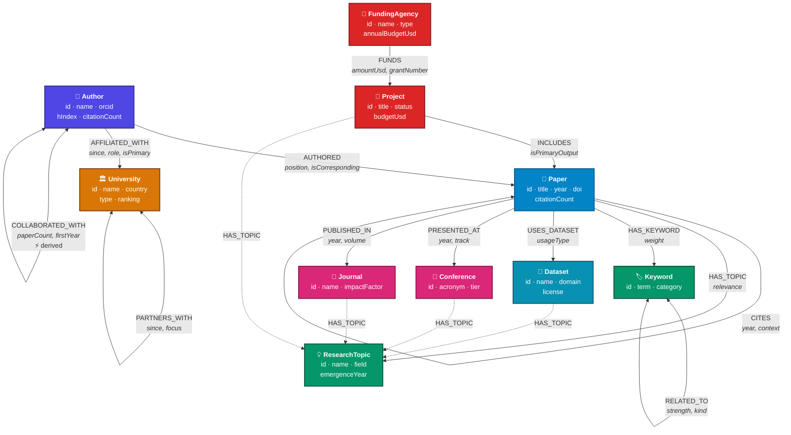
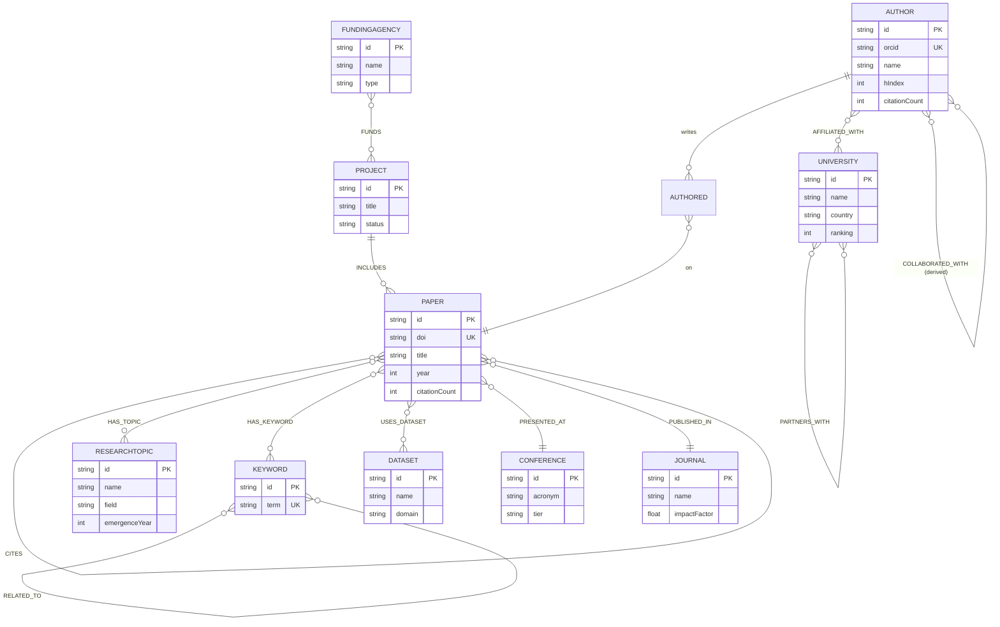

# Research Nexus — Graph Data Model & Application Design

**AI-Powered Research Collaboration & Knowledge Discovery Platform**

The complete architecture and graph model specification: node schema,
relationship semantics, visual model, user journeys with the traversals that
power them, and the justification for choosing a graph engine feature by feature.

Target engine: **CognoDB** (Bolt protocol, OpenCypher dialect).

> **Reading this alongside the code.** This document specifies the model. Where
> the shipped implementation names something differently, the mapping is recorded
> in [Implementation reconciliation](#implementation-reconciliation) at the end.

---

## Table of contents

1. [Design principles](#design-principles)
2. [Node schema](#node-schema)
3. [Relationship schema](#relationship-schema)
4. [Visual graph model](#visual-graph-model)
5. [User journeys](#user-journeys)
6. [Why a graph database](#why-a-graph-database-feature-by-feature)
7. [Scaling characteristics](#scaling-characteristics)
8. [Implementation reconciliation](#implementation-reconciliation)

---

## Design principles

Five rules govern every modelling decision below.

**1. If it has an identity, it is a node.** A research topic is not a string
column on a paper — it is an entity with its own emergence year, its own field,
and its own relationships to other topics. Modelling it as a node is what makes
"topics related to this one" a traversal instead of a text-matching heuristic.

**2. If a fact belongs to the connection, it goes on the relationship.** Author
position on a paper belongs to the *authorship*, not the author and not the
paper. Grant amount belongs to the *award*, not the agency and not the project.
Relationship properties are the feature that makes this expressible.

**3. Denormalise only where a traversal is hot and derivable.**
`COLLABORATED_WITH` is fully derivable from `AUTHORED`, but materialising it
turns the most-executed traversal in the product from four hops into one. That is
the bar: measurable traversal savings on a hot path, recomputed deterministically
at load.

**4. Every traversal is bounded.** No variable-length pattern is open-ended. Each
declares a literal structural maximum, the caller narrows it, and a node budget
caps the result. A hub node must never be able to return a subgraph that stalls
the client.

**5. Portability over vendor features.** No APOC, no GDS, no engine-specific
full-text calls. Counting uses `OPTIONAL MATCH` + `count()`. Search uses an
indexed `searchText` property with `CONTAINS`. The same statements run on CognoDB
and Neo4j unchanged.

---

## Node schema

Ten labels. Every node carries a stable business key in `id` — human-readable,
URL-safe, and unique — plus a lowercased `searchText` blob that backs global
search from a single index.

---

### `Author`

**Description.** A researcher. The central actor: authors produce papers, hold
affiliations, form collaboration networks, and work on funded projects. Almost
every interesting traversal in the product either starts or ends here.

| Property | Type | Req. | Notes |
|---|---|:--:|---|
| `id` | string | ✔ | `author-0042` |
| `name` | string | ✔ | Display name |
| `orcid` | string | ✔ | Global researcher identifier |
| `title` | string | ✔ | Academic rank |
| `primaryField` | string | ✔ | Broad discipline |
| `careerStartYear` | integer | ✔ | Bounds which papers they can appear on |
| `searchText` | string | ✔ | Lowercased `name + title + primaryField` |
| `email` | string | | Contact |
| `researchStatement` | string | | Prose bio |
| `hIndex` | integer | | **Derived** from the citation graph |
| `citationCount` | integer | | **Derived** — sum over authored papers |
| `paperCount` | integer | | **Derived** — count of `AUTHORED` |
| `homepageUrl` | string | | |
| `googleScholarId` | string | | |

**Unique constraints**
```cypher
CREATE CONSTRAINT author_id_unique IF NOT EXISTS
FOR (n:Author) REQUIRE n.id IS UNIQUE;

CREATE CONSTRAINT author_orcid_unique IF NOT EXISTS
FOR (n:Author) REQUIRE n.orcid IS UNIQUE;
```

**Indexes**
```cypher
CREATE INDEX author_search_text  IF NOT EXISTS FOR (n:Author) ON (n.searchText);
CREATE INDEX author_h_index      IF NOT EXISTS FOR (n:Author) ON (n.hIndex);
CREATE INDEX author_citations    IF NOT EXISTS FOR (n:Author) ON (n.citationCount);
CREATE INDEX author_field        IF NOT EXISTS FOR (n:Author) ON (n.primaryField);
```

**Why these indexes.** `searchText` backs the command palette. `hIndex` and
`citationCount` back every "top researchers" ranking. `primaryField` backs
faceted filtering. The `id` seek is already covered by the constraint.

---

### `Paper`

**Description.** A publication. The hub through which authors, topics, keywords,
datasets, venues and projects all connect — and the node whose self-referential
`CITES` edges form the citation network.

| Property | Type | Req. | Notes |
|---|---|:--:|---|
| `id` | string | ✔ | `paper-0311` |
| `title` | string | ✔ | |
| `year` | integer | ✔ | Publication year |
| `doi` | string | ✔ | Global identifier |
| `searchText` | string | ✔ | Lowercased title + topic + keywords |
| `abstract` | string | | Full text |
| `url` | string | | |
| `citationCount` | integer | | **Derived** — incoming `CITES` |
| `referenceCount` | integer | | **Derived** — outgoing `CITES` |
| `language` | string | | Default `en` |
| `openAccess` | boolean | | |
| `pageCount` | integer | | |

**Unique constraints**
```cypher
CREATE CONSTRAINT paper_id_unique  IF NOT EXISTS FOR (n:Paper) REQUIRE n.id IS UNIQUE;
CREATE CONSTRAINT paper_doi_unique IF NOT EXISTS FOR (n:Paper) REQUIRE n.doi IS UNIQUE;
```

**Indexes**
```cypher
CREATE INDEX paper_search_text IF NOT EXISTS FOR (n:Paper) ON (n.searchText);
CREATE INDEX paper_year        IF NOT EXISTS FOR (n:Paper) ON (n.year);
CREATE INDEX paper_citations   IF NOT EXISTS FOR (n:Paper) ON (n.citationCount);

-- Composite: "highly cited papers since 2020" is the single most common filter
CREATE INDEX paper_year_citations IF NOT EXISTS FOR (n:Paper) ON (n.year, n.citationCount);
```

---

### `University`

**Description.** A research institution. Connects to people through affiliation,
and to other institutions through formal partnership. Institutional research
output is never stored — it is derived by traversing to researchers and their
papers, so it can never drift out of date.

| Property | Type | Req. | Notes |
|---|---|:--:|---|
| `id` | string | ✔ | `university-0005` |
| `name` | string | ✔ | |
| `country` | string | ✔ | Drives international-collaboration analytics |
| `city` | string | ✔ | |
| `type` | string | ✔ | Public Research / Private Research / Technical Institute / National Laboratory |
| `searchText` | string | ✔ | |
| `foundedYear` | integer | | |
| `ranking` | integer | | Global rank |
| `website` | string | | |
| `researcherCount` | integer | | **Derived** |

**Constraints & indexes**
```cypher
CREATE CONSTRAINT university_id_unique IF NOT EXISTS
FOR (n:University) REQUIRE n.id IS UNIQUE;

CREATE INDEX university_search_text IF NOT EXISTS FOR (n:University) ON (n.searchText);
CREATE INDEX university_country     IF NOT EXISTS FOR (n:University) ON (n.country);
CREATE INDEX university_ranking     IF NOT EXISTS FOR (n:University) ON (n.ranking);
```

---

### `ResearchTopic`

**Description.** A field of study. A first-class node, not a tag — because it
carries its own emergence year (which makes trend analysis possible), its own
field classification (which makes cross-domain detection possible), and its own
edges to sibling topics.

| Property | Type | Req. | Notes |
|---|---|:--:|---|
| `id` | string | ✔ | `topic-0001` |
| `name` | string | ✔ | e.g. "Graph Neural Networks" |
| `field` | string | ✔ | Parent discipline |
| `searchText` | string | ✔ | |
| `description` | string | | |
| `emergenceYear` | integer | | Year the area became recognisable |
| `paperCount` | integer | | **Derived** |
| `wikidataId` | string | | External linkage |

**Constraints & indexes**
```cypher
CREATE CONSTRAINT topic_id_unique IF NOT EXISTS
FOR (n:ResearchTopic) REQUIRE n.id IS UNIQUE;

CREATE INDEX topic_search_text IF NOT EXISTS FOR (n:ResearchTopic) ON (n.searchText);
CREATE INDEX topic_field       IF NOT EXISTS FOR (n:ResearchTopic) ON (n.field);
CREATE INDEX topic_paper_count IF NOT EXISTS FOR (n:ResearchTopic) ON (n.paperCount);

CREATE INDEX topic_field_papers IF NOT EXISTS
FOR (n:ResearchTopic) ON (n.field, n.paperCount);
```

---

### `Keyword`

**Description.** A fine-grained term. Deliberately more granular than a topic:
keywords are the signal that connects two papers addressing the same *problem*
even when they sit under different topic labels. This is what rescues similarity
when topic overlap is zero.

| Property | Type | Req. | Notes |
|---|---|:--:|---|
| `id` | string | ✔ | `keyword-0087` |
| `term` | string | ✔ | Normalised, lowercase |
| `searchText` | string | ✔ | |
| `paperCount` | integer | | **Derived** |
| `category` | string | | method / task / domain / metric |

**Constraints & indexes**
```cypher
CREATE CONSTRAINT keyword_id_unique   IF NOT EXISTS FOR (n:Keyword) REQUIRE n.id IS UNIQUE;
CREATE CONSTRAINT keyword_term_unique IF NOT EXISTS FOR (n:Keyword) REQUIRE n.term IS UNIQUE;

CREATE INDEX keyword_search_text IF NOT EXISTS FOR (n:Keyword) ON (n.searchText);
CREATE INDEX keyword_paper_count IF NOT EXISTS FOR (n:Keyword) ON (n.paperCount);
```

**Why `term` is unique.** Without it, near-duplicate keyword nodes fragment the
graph: two papers using "graph neural network" and "graph neural networks" would
share no keyword, and the similarity traversal would silently miss them.

---

### `Conference`

**Description.** A venue where work is presented. Carries a quality tier, which
lets rankings weight a tier-A\* paper above a workshop paper without a separate
prestige table.

| Property | Type | Req. | Notes |
|---|---|:--:|---|
| `id` | string | ✔ | `conference-0003` |
| `name` | string | ✔ | |
| `acronym` | string | ✔ | NeurIPS, ICML, CHI |
| `field` | string | ✔ | |
| `searchText` | string | ✔ | |
| `tier` | string | | `A*` / `A` / `B` |
| `foundedYear` | integer | | |
| `location` | string | | Most recent edition |
| `website` | string | | |
| `paperCount` | integer | | **Derived** |

**Constraints & indexes**
```cypher
CREATE CONSTRAINT conference_id_unique IF NOT EXISTS
FOR (n:Conference) REQUIRE n.id IS UNIQUE;

CREATE INDEX conference_search_text IF NOT EXISTS FOR (n:Conference) ON (n.searchText);
CREATE INDEX conference_tier        IF NOT EXISTS FOR (n:Conference) ON (n.tier);
CREATE INDEX conference_field       IF NOT EXISTS FOR (n:Conference) ON (n.field);
```

---

### `Journal`

**Description.** A peer-reviewed publication venue. Separate from `Conference`
because the properties genuinely differ — impact factor, ISSN, publisher, volume
and issue have no conference analogue.

| Property | Type | Req. | Notes |
|---|---|:--:|---|
| `id` | string | ✔ | `journal-0002` |
| `name` | string | ✔ | |
| `publisher` | string | ✔ | |
| `searchText` | string | ✔ | |
| `issn` | string | | |
| `field` | string | | May be `Multidisciplinary` |
| `impactFactor` | float | | |
| `website` | string | | |
| `openAccess` | boolean | | |
| `paperCount` | integer | | **Derived** |

**Constraints & indexes**
```cypher
CREATE CONSTRAINT journal_id_unique IF NOT EXISTS
FOR (n:Journal) REQUIRE n.id IS UNIQUE;

CREATE INDEX journal_search_text  IF NOT EXISTS FOR (n:Journal) ON (n.searchText);
CREATE INDEX journal_impact       IF NOT EXISTS FOR (n:Journal) ON (n.impactFactor);
```

---

### `FundingAgency`

**Description.** An organisation that funds research. It never connects directly
to a paper or a researcher — money flows through projects. That indirection is
deliberate and is what makes "which funders support my research area" a real
four-hop question with a real answer.

| Property | Type | Req. | Notes |
|---|---|:--:|---|
| `id` | string | ✔ | `agency-0001` |
| `name` | string | ✔ | |
| `country` | string | ✔ | |
| `type` | string | ✔ | Government / Supranational / Private Foundation / Industry Consortium |
| `searchText` | string | ✔ | |
| `annualBudgetUsd` | integer | | |
| `website` | string | | |
| `foundedYear` | integer | | |

**Constraints & indexes**
```cypher
CREATE CONSTRAINT agency_id_unique IF NOT EXISTS
FOR (n:FundingAgency) REQUIRE n.id IS UNIQUE;

CREATE INDEX agency_search_text IF NOT EXISTS FOR (n:FundingAgency) ON (n.searchText);
CREATE INDEX agency_country     IF NOT EXISTS FOR (n:FundingAgency) ON (n.country);
CREATE INDEX agency_type        IF NOT EXISTS FOR (n:FundingAgency) ON (n.type);
```

---

### `Dataset`

**Description.** A shared research asset. Datasets create *non-obvious* bridges:
two papers in unrelated fields that use the same benchmark are methodologically
connected in a way no topic or citation edge reveals.

| Property | Type | Req. | Notes |
|---|---|:--:|---|
| `id` | string | ✔ | `dataset-0012` |
| `name` | string | ✔ | |
| `domain` | string | ✔ | |
| `searchText` | string | ✔ | |
| `license` | string | | CC BY 4.0, MIT, DUA required |
| `sizeGb` | float | | |
| `releaseYear` | integer | | Bounds which papers can use it |
| `url` | string | | |
| `paperCount` | integer | | **Derived** |

**Constraints & indexes**
```cypher
CREATE CONSTRAINT dataset_id_unique IF NOT EXISTS
FOR (n:Dataset) REQUIRE n.id IS UNIQUE;

CREATE INDEX dataset_search_text IF NOT EXISTS FOR (n:Dataset) ON (n.searchText);
CREATE INDEX dataset_domain      IF NOT EXISTS FOR (n:Dataset) ON (n.domain);
```

---

### `Project`

**Description.** A funded research programme. The junction between money and
output: funders award grants to projects, and projects include papers. Without
this node, the funding side of the graph would be disconnected from the research
side.

| Property | Type | Req. | Notes |
|---|---|:--:|---|
| `id` | string | ✔ | `project-0044` |
| `title` | string | ✔ | |
| `status` | string | ✔ | Active / Completed / Planned |
| `startYear` | integer | ✔ | |
| `searchText` | string | ✔ | |
| `summary` | string | | |
| `endYear` | integer | | |
| `budgetUsd` | integer | | Total across all funders |
| `websiteUrl` | string | | |

**Constraints & indexes**
```cypher
CREATE CONSTRAINT project_id_unique IF NOT EXISTS
FOR (n:Project) REQUIRE n.id IS UNIQUE;

CREATE INDEX project_search_text IF NOT EXISTS FOR (n:Project) ON (n.searchText);
CREATE INDEX project_status      IF NOT EXISTS FOR (n:Project) ON (n.status);
CREATE INDEX project_start_year  IF NOT EXISTS FOR (n:Project) ON (n.startYear);
```

---

### Index strategy summary

| Purpose | Mechanism |
|---|---|
| Entity lookup by id | Uniqueness constraint (index-backed) — a single seek |
| Global search | `searchText` range index + `CONTAINS`, portable across engines |
| Ranking / sorting | Indexes on `hIndex`, `citationCount`, `impactFactor`, `ranking`, `paperCount` |
| Faceted filtering | Indexes on `field`, `country`, `tier`, `type`, `domain`, `status` |
| Compound filters | `Paper(year, citationCount)`, `ResearchTopic(field, paperCount)` |
| Deduplication | Unique constraints on `orcid`, `doi`, `term` |

---

## Relationship schema

Thirteen types. Direction is chosen so that the *natural reading* of the pattern
matches the sentence a user would say.

---

### `(:Author)-[:AUTHORED]->(:Paper)`

**Why it exists.** The foundational edge. Everything about scholarly
contribution — output, impact, collaboration, expertise — is derived from it.

| Property | Type | Notes |
|---|---|---|
| `position` | integer | 1-based order in the byline |
| `isCorresponding` | boolean | Contact author |
| `contribution` | string | Optional CRediT role |

**Traversal enablement.** This is the edge that makes co-authorship expressible:
two authors are collaborators precisely when they share a `Paper` through it.

```cypher
// Co-authorship — the seed of the entire collaboration network
MATCH (a:Author)-[:AUTHORED]->(:Paper)<-[:AUTHORED]-(b:Author)
```

`position` matters: first-author and last-author papers carry different weight
in academic assessment, and that nuance lives on the relationship because it
belongs to neither endpoint alone.

---

### `(:Paper)-[:CITES]->(:Paper)`

**Why it exists.** A self-referential edge creating a directed acyclic graph of
intellectual lineage. This single edge type powers citation counts, impact
ranking, co-citation similarity, bibliographic coupling and lineage tracing.

| Property | Type | Notes |
|---|---|---|
| `year` | integer | Year of the citing paper |
| `context` | string | Optional sentence surrounding the citation |
| `isSelfCitation` | boolean | Optional; excluded from some metrics |

**Traversal enablement.** Direction carries meaning, and reversing it changes
the question entirely:

```cypher
(paper)-[:CITES]->()    // what it builds on  → ancestry
(paper)<-[:CITES]-()    // what builds on it  → influence
```

Two classic bibliometric measures fall out as two-hop patterns:

```cypher
// Co-citation: cited together by the same paper ⇒ the field treats them as related
(a)<-[:CITES]-(:Paper)-[:CITES]->(b)

// Bibliographic coupling: they cite the same sources ⇒ same intellectual base
(a)-[:CITES]->(:Paper)<-[:CITES]-(b)
```

Each of these would be a self-join of a citations table in SQL. Here each is one
line.

---

### `(:Author)-[:AFFILIATED_WITH]->(:University)`

**Why it exists.** Connects people to institutions, which is what makes
institutional analytics possible without storing any institutional metrics.

| Property | Type | Notes |
|---|---|---|
| `since` | integer | Start year |
| `until` | integer | Null while current |
| `role` | string | Faculty, PI, Visiting Researcher… |
| `isPrimary` | boolean | Distinguishes main from secondary posts |

**Traversal enablement.** Institutional output is a three-hop derivation:

```cypher
MATCH (u:University)<-[:AFFILIATED_WITH]-(:Author)-[:AUTHORED]->(p:Paper)
RETURN count(DISTINCT p)
```

Secondary affiliations matter more than they look: visiting appointments are
what keep cross-institution paths short, and they are the reason the shortest
path between two researchers at different universities is often 2–3 hops rather
than 6.

---

### `(:Paper)-[:HAS_TOPIC]->(:ResearchTopic)`

**Why it exists.** Subject classification as a traversable edge rather than a
column. Also emitted from `Conference`, `Journal`, `Dataset` and `Project`, which
is what lets a single pattern answer "everything about this topic".

| Property | Type | Notes |
|---|---|---|
| `relevance` | float | 0–1; primary topic ≈ 0.9, secondary ≈ 0.3 |
| `assignedBy` | string | `author` / `classifier` / `editor` |

**Traversal enablement.** Two papers sharing a topic are related, and the
strength of that relation is countable:

```cypher
MATCH (a:Paper)-[:HAS_TOPIC]->(t)<-[:HAS_TOPIC]-(b:Paper)
WITH a, b, count(t) AS sharedTopics
```

`relevance` prevents a marginal tag from carrying the same weight as the paper's
actual subject — a distinction that a join table with no payload cannot express.

---

### `(:Paper)-[:USES_DATASET]->(:Dataset)`

**Why it exists.** Records methodological grounding, and creates cross-domain
bridges that no other edge produces.

| Property | Type | Notes |
|---|---|---|
| `usageType` | string | training / evaluation / validation / ablation / replication |
| `subset` | string | Optional partition used |

**Traversal enablement.** This edge finds connections invisible to topic or
citation analysis:

```cypher
// A climate paper and a genomics paper sharing a benchmark are
// methodologically connected — nothing else in the graph reveals this
MATCH (a:Paper)-[:USES_DATASET]->(d)<-[:USES_DATASET]-(b:Paper)
WHERE NOT (a)-[:HAS_TOPIC]->()<-[:HAS_TOPIC]-(b)
```

---

### `(:Paper)-[:PRESENTED_AT]->(:Conference)`

**Why it exists.** Venue attribution for conference papers, with the edition
recorded on the edge so one `Conference` node serves every year.

| Property | Type | Notes |
|---|---|---|
| `year` | integer | Which edition |
| `track` | string | Main / Oral / Poster / Workshop |
| `isBestPaper` | boolean | |

**Traversal enablement.** `year` on the relationship is the key design choice.
Without it, a 30-year-old conference would need 30 nodes; with it, a single node
plus an edge property answers "papers at NeurIPS 2023" *and* "output per year"
from the same structure.

---

### `(:Paper)-[:PUBLISHED_IN]->(:Journal)`

**Why it exists.** Venue attribution for journal articles, with volume and issue
on the edge for the same reason.

| Property | Type | Notes |
|---|---|---|
| `year` | integer | |
| `volume` | integer | |
| `issue` | integer | |
| `pages` | string | |

A paper has at most one of `PRESENTED_AT` / `PUBLISHED_IN`. Keeping the two edge
types distinct rather than a single `VENUE` edge with a discriminator means a
query for journal articles is a pattern match, not a filter.

---

### `(:FundingAgency)-[:FUNDS]->(:Project)`

**Why it exists.** Money flows agency → project. Direction reads naturally and
matches the real-world act of awarding a grant.

| Property | Type | Notes |
|---|---|---|
| `amountUsd` | integer | This agency's share |
| `grantNumber` | string | Award reference |
| `startYear` | integer | |
| `endYear` | integer | |

**Traversal enablement.** Co-funding — multiple agencies on one project — is
expressed simply by multiple incoming edges, and the amounts stay separable
because each lives on its own edge:

```cypher
MATCH (a1:FundingAgency)-[g1:FUNDS]->(p:Project)<-[g2:FUNDS]-(a2:FundingAgency)
WHERE a1.id < a2.id
RETURN a1, a2, count(p) AS jointProjects, sum(g1.amountUsd + g2.amountUsd) AS total
```

---

### `(:Project)-[:INCLUDES]->(:Paper)`

**Why it exists.** Closes the loop from funding to research output. Combined with
`FUNDS`, it makes the full money-to-result chain traversable.

| Property | Type | Notes |
|---|---|---|
| `isPrimaryOutput` | boolean | Flagship deliverable |
| `acknowledged` | boolean | Whether the grant is credited in the paper |

**Traversal enablement.** The four-hop chain that connects a funder to a research
area — with no direct edge between them anywhere in the graph:

```cypher
MATCH (agency:FundingAgency)-[:FUNDS]->(:Project)-[:INCLUDES]->(:Paper)-[:HAS_TOPIC]->(t:ResearchTopic)
RETURN agency.name, t.name, count(*) AS papers
```

---

### `(:Author)-[:COLLABORATED_WITH]->(:Author)`

**Why it exists.** A **derived, materialised** edge — the one deliberate
denormalisation in the model.

| Property | Type | Notes |
|---|---|---|
| `paperCount` | integer | Number of shared papers — the tie strength |
| `firstYear` | integer | Start of the working relationship |
| `lastYear` | integer | Most recent; distinguishes active from dormant |

**How it is computed.** After load, from `AUTHORED`:

```cypher
MATCH (a:Author)-[:AUTHORED]->(p:Paper)<-[:AUTHORED]-(b:Author)
WHERE a.id < b.id
WITH a, b, count(p) AS shared, min(p.year) AS first, max(p.year) AS last
MERGE (a)-[r:COLLABORATED_WITH]->(b)
SET r.paperCount = shared, r.firstYear = first, r.lastYear = last
```

**Why materialise it.** Without this edge, a two-hop collaboration query is
*eight* hops through papers. With it, two hops. Traversing depth 3 is the
difference between a responsive UI and a timeout.

**Undirected semantics.** Stored once in canonical order (`a.id < b.id`), matched
without an arrow. This halves the edge count and removes any possibility of the
two directions disagreeing about `paperCount`.

```cypher
MATCH (a:Author)-[:COLLABORATED_WITH]-(peer:Author)   // no arrow
```

---

### `(:Paper)-[:HAS_KEYWORD]->(:Keyword)`

**Why it exists.** Fine-grained subject indexing beneath the topic layer.

| Property | Type | Notes |
|---|---|---|
| `weight` | float | Optional TF-IDF-style salience |

**Traversal enablement.** Keywords catch similarity that topics miss. Two papers
under different topics that both address "differential privacy" are related, and
only the keyword layer sees it.

---

### `(:Keyword)-[:RELATED_TO]->(:Keyword)`

**Why it exists.** A semantic network *beneath* the topic layer, enabling query
expansion — searching "GNN" can reach papers tagged "message passing" without any
text-matching heuristic.

| Property | Type | Notes |
|---|---|---|
| `strength` | float | 0–1 association strength |
| `kind` | string | `synonym` / `broader` / `narrower` / `co-occurring` |

**Traversal enablement.** `kind` turns a flat association list into a navigable
taxonomy — `broader`/`narrower` walk a hierarchy, `synonym` merges variants at
query time, `co-occurring` supports discovery. Multi-hop expansion:

```cypher
MATCH (k:Keyword { term: $term })-[r:RELATED_TO*1..2]-(expanded:Keyword)
WHERE all(rel IN r WHERE rel.strength >= 0.5)
```

Undirected in practice for `synonym` and `co-occurring`; directed for
`broader`/`narrower`, where the arrow carries the hierarchy.

---

### `(:University)-[:PARTNERS_WITH]->(:University)`

**Why it exists.** Formal institutional agreements — joint programmes, shared
facilities, exchange schemes.

| Property | Type | Notes |
|---|---|---|
| `since` | integer | |
| `focus` | string | Nature of the partnership |
| `agreementType` | string | MoU / joint centre / exchange |

**Traversal enablement.** This edge captures *declared* partnership. Note what is
deliberately **not** stored: informal institutional closeness — two universities
whose researchers co-author constantly — which is *discovered* by traversal
instead:

```cypher
// Declared partnership
MATCH (a:University)-[:PARTNERS_WITH]-(b:University)

// Actual collaboration — no edge required
MATCH (a:University)<-[:AFFILIATED_WITH]-(:Author)-[:COLLABORATED_WITH]-(:Author)
      -[:AFFILIATED_WITH]->(b:University)
WHERE a.id < b.id
RETURN a, b, count(*) AS strength
```

Comparing the two answers a genuinely useful question: which partnerships exist
on paper but produce no joint work, and which collaborations are thriving without
any formal agreement.

---

### Relationship summary

| Relationship | Pattern | Key properties | Cardinality |
|---|---|---|---|
| `AUTHORED` | `Author → Paper` | `position`, `isCorresponding` | M:N |
| `CITES` | `Paper → Paper` | `year`, `context` | M:N, acyclic |
| `AFFILIATED_WITH` | `Author → University` | `since`, `role`, `isPrimary` | M:N |
| `HAS_TOPIC` | `Paper/Venue/Project → ResearchTopic` | `relevance` | M:N |
| `USES_DATASET` | `Paper → Dataset` | `usageType` | M:N |
| `PRESENTED_AT` | `Paper → Conference` | `year`, `track` | N:1 |
| `PUBLISHED_IN` | `Paper → Journal` | `year`, `volume`, `issue` | N:1 |
| `FUNDS` | `FundingAgency → Project` | `amountUsd`, `grantNumber` | M:N |
| `INCLUDES` | `Project → Paper` | `isPrimaryOutput` | 1:N |
| `COLLABORATED_WITH` | `Author ↔ Author` | `paperCount`, `firstYear`, `lastYear` | M:N, **derived** |
| `HAS_KEYWORD` | `Paper → Keyword` | `weight` | M:N |
| `RELATED_TO` | `Keyword ↔ Keyword` | `strength`, `kind` | M:N |
| `PARTNERS_WITH` | `University ↔ University` | `since`, `focus` | M:N |

---

## Visual graph model

### Mermaid — full model



Dotted edges are the secondary `HAS_TOPIC` emitters — venues, datasets and
projects also carry topic edges, which is what makes "everything about this
topic" a single pattern rather than five separate queries.

### Mermaid — entity relationship view



### ASCII relationship diagram

```
                          ┌──────────────────┐
                          │  FundingAgency   │
                          │  type, budget    │
                          └────────┬─────────┘
                                   │ FUNDS
                                   │ {amountUsd, grantNumber}
                                   ▼
                          ┌──────────────────┐
                          │     Project      │
                          │  status, budget  │
                          └────────┬─────────┘
                                   │ INCLUDES
                                   │ {isPrimaryOutput}
                                   ▼
   ┌────────────────┐   AUTHORED   ┌──────────────────┐   HAS_TOPIC   ┌───────────────┐
   │     Author     ├─────────────▶│      Paper       ├──────────────▶│ ResearchTopic │
   │ orcid, hIndex  │ {position}   │ title,year,doi   │ {relevance}   │ field, since  │
   └───┬────────┬───┘              └───┬──┬──┬────┬───┘               └───────────────┘
       │        │                      │  │  │    │
       │        │ COLLABORATED_WITH    │  │  │    │ HAS_KEYWORD {weight}
       │        │ {paperCount} ⚡       │  │  │    ▼
       │        └──────┐               │  │  │  ┌───────────────┐
       │               │               │  │  │  │   Keyword     │◀─┐
       │        ┌──────▼───────┐       │  │  │  │ term,category │  │ RELATED_TO
       │        │    Author    │       │  │  │  └───────┬───────┘  │ {strength,kind}
       │        └──────────────┘       │  │  │          └──────────┘
       │                               │  │  │
       │ AFFILIATED_WITH               │  │  └──── USES_DATASET {usageType}
       │ {since, role, isPrimary}      │  │             ▼
       ▼                               │  │        ┌──────────┐
   ┌────────────────┐                  │  │        │ Dataset  │
   │   University   │◀─┐               │  │        │  domain  │
   │ country,rank   │  │ PARTNERS_WITH │  │        └──────────┘
   └───────┬────────┘  │ {since,focus} │  │
           └───────────┘               │  │
                                       │  └── PRESENTED_AT {year,track} ──▶ ┌────────────┐
                                       │                                    │ Conference │
                                       │                                    │  tier      │
                                       │                                    └────────────┘
                                       │
                                       └───── PUBLISHED_IN {year,volume} ──▶ ┌────────────┐
                                                                             │  Journal   │
                                       ▲                                     │ impactF.   │
                                       │ CITES {year}                        └────────────┘
                                       └──────── (self-referential)

   ⚡ = derived edge, materialised after load
```

### Entity relationship explanation

The model has **four concentric layers**, and understanding them explains why
almost every valuable query is a multi-hop traversal.

**Layer 1 — the People/Work core.** `Author` and `Paper` joined by `AUTHORED`.
This is where the density is, and it is where every traversal ultimately starts
or ends. `CITES` makes `Paper` self-referential, producing the citation DAG;
`COLLABORATED_WITH` makes `Author` self-referential, producing the social
network. Two recursive structures overlaid on one bipartite core.

**Layer 2 — Semantics.** `ResearchTopic` and `Keyword` classify papers at two
granularities, with `RELATED_TO` weaving keywords into a navigable semantic
network. This layer is what turns "find similar" from string matching into
traversal.

**Layer 3 — Context.** `University`, `Conference`, `Journal`, `Dataset` — where
work happens, where it appears, what it was built on. Each provides a *different
kind of bridge* between papers, which matters: two papers can be connected by
shared venue, shared institution or shared dataset even when they share no topic
and no citation.

**Layer 4 — Economics.** `FundingAgency` → `Project` → `Paper`. Deliberately
indirect. There is no edge from an agency to a paper anywhere, because in
reality funders do not fund papers — they fund programmes.

**The critical property: no layer connects to another by more than one hop.**
An `Author` reaches a `FundingAgency` in three hops via papers and projects, and
reaches a `Dataset` in two. That bounded diameter is why traversals stay fast,
and it is a direct consequence of routing everything through `Paper` as the
central hub rather than adding shortcut edges between peripheral entities.

---

## User journeys

Every widget below states its data source and the traversal that produces it.

---

### Home dashboard

```
┌─────────────────────────────────────────────────────────────────────┐
│  [🔍 Search the research graph…]                            ⌘K      │
├─────────────────────────────────────────────────────────────────────┤
│  Researchers 300   Papers 600   Topics 100   Funded $340M           │
├──────────────────────────────────┬──────────────────────────────────┤
│  📈 Trending Research Topics     │  📊 Research Statistics          │
│  Graph Neural Networks  ↑2.4×    │  1,420 nodes · 16,000 edges      │
│  Retrieval-Augmented…   ↑1.9×    │  11.3 relationships per entity   │
├──────────────────────────────────┼──────────────────────────────────┤
│  👤 Popular Authors              │  🎤 Featured Conferences         │
├──────────────────────────────────┼──────────────────────────────────┤
│  📄 Recent Papers                │  📕 Latest Publications          │
└──────────────────────────────────┴──────────────────────────────────┘
```

#### Global search

Debounced 220 ms, min 2 characters, one round trip across all ten labels via
`UNION ALL`. Ranking prefers prefix matches, then popularity.

```cypher
MATCH (n:Author) WHERE n.searchText CONTAINS $q
RETURN 'Author' AS label, n.id AS id, n.name AS title,
       (CASE WHEN n.searchText STARTS WITH $q THEN 2.0 ELSE 1.0 END)
         + log(toFloat(coalesce(n.citationCount,0)) + 1) / 10.0 AS score
ORDER BY score DESC LIMIT $perLabel
UNION ALL
MATCH (n:Paper) WHERE n.searchText CONTAINS $q
RETURN 'Paper' AS label, n.id, n.title, /* … same scoring shape … */ AS score
ORDER BY score DESC LIMIT $perLabel
UNION ALL
/* … eight more branches … */
```

**Why one query.** Ten sequential requests would mean ten round trips per
keystroke. `UNION ALL` collapses them into one, and each branch is an index scan
on `searchText`.

#### Trending research topics

Compares a recent window against the window immediately before it — the growth
rate is *derived at query time*, not stored.

```cypher
MATCH (topic:ResearchTopic)<-[:HAS_TOPIC]-(paper:Paper)
WHERE paper.year >= $priorFromYear
WITH topic,
     sum(CASE WHEN paper.year >= $recentFromYear THEN 1 ELSE 0 END) AS recentCount,
     sum(CASE WHEN paper.year <  $recentFromYear THEN 1 ELSE 0 END) AS priorCount
WHERE recentCount >= $minRecentPapers
WITH topic, recentCount, priorCount,
     toFloat(recentCount) / toFloat(CASE WHEN priorCount = 0 THEN 1 ELSE priorCount END) AS growthRate
RETURN topic, recentCount, priorCount, growthRate,
       growthRate * log(toFloat(recentCount) + 1) AS momentum
ORDER BY momentum DESC LIMIT $limit
```

`momentum` multiplies growth by log-volume so a topic going from 1 paper to 3
does not outrank one going from 40 to 90.

#### Popular authors

```cypher
MATCH (author:Author)
WITH author ORDER BY author.citationCount DESC, author.hIndex DESC LIMIT $limit
OPTIONAL MATCH (author)-[:AFFILIATED_WITH { isPrimary: true }]->(u:University)
RETURN author, head(collect(u)) AS affiliation
```

Index-backed sort on `citationCount`, then one optional hop for affiliation.

#### Recent papers / latest publications

```cypher
MATCH (paper:Paper)
WITH paper ORDER BY paper.year DESC, paper.citationCount DESC
SKIP $offset LIMIT $limit
OPTIONAL MATCH (a:Author)-[au:AUTHORED]->(paper)
WITH paper, a, au ORDER BY au.position ASC
WITH paper, collect({ id: a.id, name: a.name }) AS authors
OPTIONAL MATCH (paper)-[:PUBLISHED_IN]->(j:Journal)
OPTIONAL MATCH (paper)-[:PRESENTED_AT]->(c:Conference)
RETURN paper, authors, head(collect(j)) AS journal, head(collect(c)) AS conference
```

**One traversal, four relational tables.** The SQL equivalent joins papers,
paper_authors, authors and two venue tables, then de-duplicates in the client.

#### Research statistics

```cypher
MATCH (n)          WITH head(labels(n)) AS label, count(n) AS total
RETURN { label: label, count: total } AS row ORDER BY total DESC
```
```cypher
MATCH ()-[r]->()   WITH type(r) AS type, count(r) AS total
RETURN { type: type, count: total } AS row ORDER BY total DESC
```

Density = relationships ÷ nodes. It is the dashboard's most honest number: it
shows at a glance that the connections outnumber the entities ~11:1, which is
precisely the case for the graph model.

#### Featured conferences

```cypher
MATCH (paper:Paper)-[:PRESENTED_AT]->(conf:Conference)
WITH conf, count(paper) AS papers, sum(coalesce(paper.citationCount,0)) AS citations
ORDER BY citations DESC LIMIT $limit
RETURN conf, papers, citations
```

Prestige is *computed from the graph*, not read from a stored ranking column.

---

### Search experience — "Graph Neural Networks"

A user typing this expects far more than matching papers. The graph returns an
interconnected result set: the concept, the work, the people, the places, the
data and the money.

```
"Graph Neural Networks"
   │
   ├─▶ 💡 Topic         Graph Neural Networks (AI, since 2017, 47 papers)
   ├─▶ 📄 Papers        matched directly + reached via the topic
   ├─▶ 👤 Authors       ranked by focus, not just volume
   ├─▶ 🏛 Universities  where those authors sit
   ├─▶ 🎤 Conferences   where the work is presented
   ├─▶ 📕 Journals      where it is published
   ├─▶ 🏷 Related       Message Passing, Node Embedding, Link Prediction
   ├─▶ 💾 Datasets      benchmarks used by those papers
   └─▶ 🔬 Projects      funded programmes producing the work
```

**Stage 1 — anchor.** Resolve the string to a topic node.
```cypher
MATCH (topic:ResearchTopic) WHERE topic.searchText CONTAINS $q
RETURN topic ORDER BY topic.paperCount DESC LIMIT 1
```

**Stage 2 — radiate.** From that single anchor, every other result category is
one or two hops away:

```cypher
MATCH (topic:ResearchTopic { id: $topicId })

// Papers — 1 hop
OPTIONAL MATCH (topic)<-[:HAS_TOPIC]-(paper:Paper)
WITH topic, collect(DISTINCT paper) AS papers

// Authors — 2 hops
UNWIND papers AS p
OPTIONAL MATCH (p)<-[:AUTHORED]-(author:Author)
WITH topic, papers, author, count(p) AS topicPapers
ORDER BY topicPapers DESC

// Universities — 3 hops
OPTIONAL MATCH (author)-[:AFFILIATED_WITH]->(uni:University)

// Venues — 2 hops
OPTIONAL MATCH (p)-[:PRESENTED_AT]->(conf:Conference)
OPTIONAL MATCH (p)-[:PUBLISHED_IN]->(journal:Journal)

// Datasets — 2 hops
OPTIONAL MATCH (p)-[:USES_DATASET]->(dataset:Dataset)

// Projects — 2 hops (reverse direction)
OPTIONAL MATCH (project:Project)-[:INCLUDES]->(p)

// Related topics — direct edges + keyword-mediated inference
OPTIONAL MATCH (p)-[:HAS_KEYWORD]->(:Keyword)-[:RELATED_TO]-(:Keyword)
               <-[:HAS_KEYWORD]-(:Paper)-[:HAS_TOPIC]->(related:ResearchTopic)
WHERE related.id <> topic.id
```

**Why this is the argument for graph search.** A relational search returns rows
from whichever table you queried. This returns a **connected neighbourhood** —
and crucially, the entities are related *to each other*, not merely all matching
the same string. The universities are there because those specific authors work
there. The datasets are there because those specific papers used them.

Relationally, this is eight queries against eight join paths, executed
separately and stitched together in the application. Here it is one expansion
from one anchor.

---

### Paper details page

| Section | Relationship | Traversal |
|---|---|---|
| Title, abstract, year, DOI | — | Node properties |
| Authors | `AUTHORED` | 1 hop, ordered by `position` |
| Topics | `HAS_TOPIC` | 1 hop, weighted by `relevance` |
| Keywords | `HAS_KEYWORD` | 1 hop |
| Datasets | `USES_DATASET` | 1 hop, with `usageType` |
| Conference | `PRESENTED_AT` | 1 hop, `year` + `track` from the edge |
| Journal | `PUBLISHED_IN` | 1 hop, `volume`/`issue` from the edge |
| References | `CITES` outgoing | 1 hop → |
| Cited by | `CITES` incoming | 1 hop ← |
| Citation network | `CITES` variable-length | 2–3 hops, both directions |
| Similar papers | 4 blended signals | 2 hops each |
| Related projects | `INCLUDES` reversed | 1 hop |

**The whole page in one query.** Each `OPTIONAL MATCH` walks one relationship
type from a node already pinned by an index seek:

```cypher
MATCH (paper:Paper { id: $id })

OPTIONAL MATCH (author:Author)-[au:AUTHORED]->(paper)
WITH paper, author, au ORDER BY au.position ASC
WITH paper, collect({ id: author.id, name: author.name,
                      isCorresponding: au.isCorresponding }) AS authors

OPTIONAL MATCH (paper)-[ht:HAS_TOPIC]->(topic:ResearchTopic)
WITH paper, authors, collect({ id: topic.id, name: topic.name,
                               relevance: ht.relevance }) AS topics

OPTIONAL MATCH (paper)-[:HAS_KEYWORD]->(kw:Keyword)
WITH paper, authors, topics, collect(kw) AS keywords

OPTIONAL MATCH (paper)-[ud:USES_DATASET]->(ds:Dataset)
WITH paper, authors, topics, keywords,
     collect({ dataset: ds, usageType: ud.usageType }) AS datasets

OPTIONAL MATCH (paper)-[:PRESENTED_AT]->(conf:Conference)
OPTIONAL MATCH (paper)-[:PUBLISHED_IN]->(journal:Journal)
OPTIONAL MATCH (project:Project)-[:INCLUDES]->(paper)

OPTIONAL MATCH (citing:Paper)-[:CITES]->(paper)
WITH paper, authors, topics, keywords, datasets, conf, journal, project,
     collect(citing)[0..12] AS citedBy

OPTIONAL MATCH (paper)-[:CITES]->(ref:Paper)
RETURN paper, authors, topics, keywords, datasets, conf, journal, project,
       citedBy, collect(ref)[0..12] AS references
```

**Similar papers** blends four independent signals, each aggregated per candidate
so the contribution stays visible and the recommendation stays explainable:

```cypher
MATCH (source:Paper { id: $paperId })

// 1. Shared topics
OPTIONAL MATCH (source)-[:HAS_TOPIC]->(t)<-[:HAS_TOPIC]-(c1:Paper)
WHERE c1 <> source
WITH source, c1 AS cand, count(DISTINCT t) AS n
WITH source, collect({ id: cand.id, topics: n, keywords: 0, coCited: 0, coupled: 0 }) AS r1

// 2. Shared keywords
OPTIONAL MATCH (source)-[:HAS_KEYWORD]->(k)<-[:HAS_KEYWORD]-(c2:Paper)
WHERE c2 <> source
WITH source, r1, c2 AS cand, count(DISTINCT k) AS n
WITH source, r1, collect({ id: cand.id, topics: 0, keywords: n, coCited: 0, coupled: 0 }) AS r2

// 3. Co-citation — cited alongside this paper
OPTIONAL MATCH (source)<-[:CITES]-(citing:Paper)-[:CITES]->(c3:Paper)
WHERE c3 <> source
WITH source, r1, r2, c3 AS cand, count(DISTINCT citing) AS n
WITH source, r1, r2, collect({ id: cand.id, topics: 0, keywords: 0, coCited: n, coupled: 0 }) AS r3

// 4. Bibliographic coupling — cites the same sources
OPTIONAL MATCH (source)-[:CITES]->(ref:Paper)<-[:CITES]-(c4:Paper)
WHERE c4 <> source
WITH r1, r2, r3, c4 AS cand, count(DISTINCT ref) AS n
WITH r1, r2, r3, collect({ id: cand.id, topics: 0, keywords: 0, coCited: 0, coupled: n }) AS r4

UNWIND (r1 + r2 + r3 + r4) AS row
WITH row.id AS candidateId,
     sum(row.topics) AS sharedTopics, sum(row.keywords) AS sharedKeywords,
     sum(row.coCited) AS coCitations,  sum(row.coupled) AS sharedRefs
WITH candidateId,
     toFloat(sharedTopics)  * $topicWeight +
     toFloat(sharedKeywords)* $keywordWeight +
     toFloat(coCitations)   * $coCitationWeight +
     toFloat(sharedRefs)    * $couplingWeight AS score,
     sharedTopics, sharedKeywords, coCitations, sharedRefs
WHERE score > 0
MATCH (candidate:Paper { id: candidateId })
RETURN candidate, score, sharedTopics, sharedKeywords, coCitations, sharedRefs
ORDER BY score DESC LIMIT $limit
```

The UI renders the four contributions as a stacked bar — the user sees *why* a
paper was recommended, not just that it was.

---

### Author profile

| Section | Relationship | Traversal |
|---|---|---|
| Profile info | — | Node properties |
| University | `AFFILIATED_WITH` | 1 hop, `isPrimary: true` |
| Research interests | `AUTHORED` + `HAS_TOPIC` | 2 hops, grouped and counted |
| Publications | `AUTHORED` | 1 hop |
| Collaborators | `COLLABORATED_WITH` | 1 hop, weighted by `paperCount` |
| Citation count | `AUTHORED` + paper counters | 1 hop + sum |
| Simulated h-index | `AUTHORED` + sort + index math | 1 hop + list comprehension |
| Co-author network | `COLLABORATED_WITH` | 2 hops, rendered as a subgraph |
| Related topics | `AUTHORED` + `HAS_TOPIC` | 2 hops |
| Active projects | `INCLUDES` reversed | 2 hops, filtered on status |

**Research interests** — derived, never stored. What someone *actually* works on
is what their papers are about:

```cypher
MATCH (author:Author { id: $id })-[:AUTHORED]->(paper:Paper)-[:HAS_TOPIC]->(topic:ResearchTopic)
WITH topic, count(DISTINCT paper) AS papers
ORDER BY papers DESC LIMIT 8
RETURN topic, papers
```

**Simulated h-index** — computed in Cypher, no application-side loop:

```cypher
MATCH (author:Author { id: $id })
OPTIONAL MATCH (author)-[:AUTHORED]->(paper:Paper)
WITH author, paper ORDER BY paper.citationCount DESC
WITH author, collect(coalesce(paper.citationCount, 0)) AS citations
WITH author, [i IN range(0, size(citations) - 1)
              WHERE citations[i] >= i + 1 | i + 1] AS qualifying
RETURN CASE WHEN size(qualifying) = 0 THEN 0
            ELSE qualifying[size(qualifying) - 1] END AS hIndex
```

Sort citations descending, keep every position where `citations[i] >= i+1`, take
the last. The definition of h-index, expressed directly.

**Co-author network** — a renderable subgraph, two hops out:

```cypher
MATCH (author:Author { id: $id })
MATCH path = (author)-[:COLLABORATED_WITH*1..2]-(peer:Author)
WITH peer, min(length(path)) AS distance
ORDER BY distance ASC, peer.hIndex DESC LIMIT $limit
WITH collect(peer) + [author] AS people
UNWIND people AS a
UNWIND people AS b
WITH people, a, b WHERE elementId(a) < elementId(b)
OPTIONAL MATCH (a)-[rel:COLLABORATED_WITH]-(b)
RETURN people AS nodes, [r IN collect(rel) WHERE r IS NOT NULL] AS edges
```

The double `UNWIND` with `elementId(a) < elementId(b)` returns only the edges
*within* the returned node set — so the renderer never receives an edge pointing
at a node it does not have.

**Active projects:**

```cypher
MATCH (author:Author { id: $id })-[:AUTHORED]->(paper:Paper)<-[:INCLUDES]-(project:Project)
WHERE project.status = 'Active'
OPTIONAL MATCH (agency:FundingAgency)-[grant:FUNDS]->(project)
RETURN project, collect({ agency: agency.name, amount: grant.amountUsd }) AS funding,
       count(DISTINCT paper) AS contributions
```

---

### Topic explorer

| Section | Traversal |
|---|---|
| Topic overview | Node properties + derived `paperCount` |
| Related topics | Direct `RELATED_TO` (keyword-mediated) **+** inferred co-occurrence |
| Top authors | 2 hops, scored on volume × impact × **focus** |
| Popular papers | 1 hop, sorted by `citationCount` |
| Latest publications | 1 hop, sorted by `year` |
| Research trends | 1 hop, grouped by `year` |
| Datasets | 2 hops via papers |
| Conferences | 2 hops via papers |
| Universities | 3 hops via papers → authors → affiliation |

**Top authors — the focus ratio is what makes this good.** Volume and citations
alone rank a prolific generalist above a genuine specialist:

```cypher
MATCH (topic:ResearchTopic { id: $topicId })<-[:HAS_TOPIC]-(paper:Paper)<-[:AUTHORED]-(author:Author)
WITH author,
     count(DISTINCT paper) AS topicPapers,
     sum(coalesce(paper.citationCount, 0)) AS topicCitations
WHERE topicPapers >= $minPapers
WITH author, topicPapers, topicCitations,
     CASE WHEN coalesce(author.paperCount, 0) = 0 THEN 0.0
          ELSE toFloat(topicPapers) / toFloat(author.paperCount) END AS focusRatio
RETURN author, topicPapers, topicCitations, focusRatio,
       toFloat(topicPapers)              * $paperWeight +
       log(toFloat(topicCitations) + 1)  * $citationWeight +
       focusRatio                        * $focusWeight +
       toFloat(coalesce(author.hIndex,0))* $hIndexWeight AS expertiseScore
ORDER BY expertiseScore DESC LIMIT $limit
```

Four papers out of five on a topic is a far stronger expertise signal than six
out of two hundred. Both numbers come from traversals off the same node.

**Related topics — two mechanisms, labelled distinctly:**

```cypher
MATCH (topic:ResearchTopic { id: $topicId })

// (a) Explicit — via the keyword semantic network
OPTIONAL MATCH (topic)<-[:HAS_TOPIC]-(:Paper)-[:HAS_KEYWORD]->(k1:Keyword)
               -[rel:RELATED_TO]-(k2:Keyword)<-[:HAS_KEYWORD]-(:Paper)
               -[:HAS_TOPIC]->(direct:ResearchTopic)
WHERE direct.id <> topic.id AND rel.strength >= $minStrength
WITH topic, collect(DISTINCT { topic: direct, strength: rel.strength,
                               kind: 'direct' }) AS directLinks

// (b) Inferred — co-occurrence on the same papers
OPTIONAL MATCH (topic)<-[:HAS_TOPIC]-(paper:Paper)-[:HAS_TOPIC]->(inferred:ResearchTopic)
WHERE inferred.id <> topic.id
WITH topic, directLinks, inferred, count(DISTINCT paper) AS coOccurrence
WITH directLinks, collect({ topic: inferred, strength: toFloat(coOccurrence),
                            kind: 'inferred' }) AS inferredLinks

UNWIND (directLinks + inferredLinks) AS link
WITH link.topic AS related, max(link.strength) AS strength,
     CASE WHEN 'direct' IN collect(link.kind) THEN 'direct' ELSE 'inferred' END AS kind
RETURN related, strength, kind ORDER BY kind ASC, strength DESC LIMIT $limit
```

**The inferred half is the valuable half.** It surfaces relationships that exist
in the literature but in nobody's taxonomy. Labelling which is which lets the UI
distinguish editorial knowledge from discovered knowledge.

**Research trends:**

```cypher
MATCH (topic:ResearchTopic { id: $topicId })<-[:HAS_TOPIC]-(paper:Paper)
WITH paper.year AS year, count(paper) AS papers,
     sum(coalesce(paper.citationCount, 0)) AS citations
RETURN year, papers, citations ORDER BY year ASC
```

---

### Collaboration explorer — "Graph AI" AND "Healthcare"

Find researchers working at the intersection of two areas — then show how they
are already connected.

```
Query: Graph AI ∩ Healthcare
   │
   ├─▶ Matching researchers   authored papers in BOTH areas
   ├─▶ Shared publications    papers tagged with both topics
   ├─▶ Shared collaborators   mutual connections between matches
   ├─▶ Common universities    institutional overlap
   ├─▶ Shortest path          how any two are already connected
   └─▶ Collaboration graph    rendered subgraph
```

**Stage 1 — intersection.** The key is the double `MATCH`: an author must have
authored in *both* areas. Not one paper covering both — two separate bodies of
work, which is the true marker of an interdisciplinary researcher.

```cypher
MATCH (t1:ResearchTopic) WHERE t1.searchText CONTAINS $topicA
MATCH (t2:ResearchTopic) WHERE t2.searchText CONTAINS $topicB

MATCH (t1)<-[:HAS_TOPIC]-(p1:Paper)<-[:AUTHORED]-(author:Author)
MATCH (t2)<-[:HAS_TOPIC]-(p2:Paper)<-[:AUTHORED]-(author)

WITH author,
     count(DISTINCT p1) AS papersA,
     count(DISTINCT p2) AS papersB,
     collect(DISTINCT p1) + collect(DISTINCT p2) AS allPapers
WITH author, papersA, papersB, allPapers,
     [p IN allPapers WHERE (p)-[:HAS_TOPIC]->(t1) AND (p)-[:HAS_TOPIC]->(t2)] AS bridgePapers

OPTIONAL MATCH (author)-[:AFFILIATED_WITH { isPrimary: true }]->(uni:University)
RETURN author, papersA, papersB,
       size(bridgePapers) AS trueBridgePapers,
       head(collect(uni)) AS university
ORDER BY trueBridgePapers DESC, (papersA + papersB) DESC
```

**Stage 2 — mutual connections among the matches:**

```cypher
UNWIND $matchedIds AS idA
UNWIND $matchedIds AS idB
WITH idA, idB WHERE idA < idB
MATCH (a:Author { id: idA }), (b:Author { id: idB })
OPTIONAL MATCH (a)-[:COLLABORATED_WITH]-(bridge:Author)-[:COLLABORATED_WITH]-(b)
OPTIONAL MATCH (a)-[:AFFILIATED_WITH]->(uni:University)<-[:AFFILIATED_WITH]-(b)
RETURN a, b,
       collect(DISTINCT bridge)[0..5] AS sharedCollaborators,
       collect(DISTINCT uni)          AS sharedUniversities
```

**Stage 3 — shortest collaboration path:**

```cypher
MATCH (from:Author { id: $fromId }), (to:Author { id: $toId })
MATCH path = shortestPath((from)-[:COLLABORATED_WITH*1..10]-(to))
WHERE length(path) <= $maxDepth
RETURN [n IN nodes(path) | { id: n.id, name: n.name }] AS chain,
       [r IN relationships(path) | { paperCount: r.paperCount,
                                     lastYear: r.lastYear }] AS ties,
       length(path) AS hops
```

`allShortestPaths` returns *every* equally short route — which matters for
introductions, because knowing there are three different two-hop routes tells you
which mutual contact to approach.

**Why this is the flagship graph feature.** Stage 1 is a double intersection over
2-hop paths. Stage 2 is a 2-hop closure between every pair of matches. Stage 3 is
unbounded shortest path. Relationally: a recursive CTE with a cycle guard, two
supporting CTEs, an anti-join and a self-join per hop — roughly 35 lines, and
shortest path degrades badly as the graph grows. `shortestPath` runs a
**bidirectional BFS**, expanding from both ends and stopping when the frontiers
meet, which explores a fraction of the space.

---

### Citation explorer

```
        Paper A  "Attention Is All You Need"
           │ CITES
           ▼
        Paper B  "BERT"
           │ CITES
           ▼
        Paper C  "Graph Attention Networks"
           │ CITES
           ▼
        Paper D  "Heterogeneous GNNs for Drug Discovery"

   ◀── backward (influence)          forward (ancestry) ──▶
```

**Forward — what it builds on:**
```cypher
MATCH (start:Paper { id: $paperId })
MATCH path = (start)-[:CITES*1..5]->(cited:Paper)
WHERE length(path) <= $maxDepth
WITH path, nodes(path) AS chain,
     reduce(total = 0, p IN nodes(path) | total + coalesce(p.citationCount, 0)) AS impact
RETURN length(path) AS depth, chain, impact
ORDER BY depth DESC, impact DESC LIMIT $limit
```

**Backward — what builds on it:** identical, with the arrow reversed
(`<-[:CITES*1..5]-`). Two prepared statements, because Cypher cannot
parameterise an arrow — the service selects, it never builds.

**Shortest citation path** — the intellectual route between two papers:
```cypher
MATCH (from:Paper { id: $fromId }), (to:Paper { id: $toId })
MATCH path = shortestPath((from)-[:CITES*1..8]-(to))
RETURN [p IN nodes(path) | { id: p.id, title: p.title, year: p.year }] AS chain,
       length(path) AS hops
```

**Citation graph for rendering** — bounded in both directions, deduplicated:
```cypher
MATCH (center:Paper { id: $paperId })
OPTIONAL MATCH backward = (center)<-[:CITES*1..2]-(:Paper)
OPTIONAL MATCH forward   = (center)-[:CITES*1..2]->(:Paper)
WITH center,
     [n IN collect(DISTINCT nodes(backward)) | n] +
     [n IN collect(DISTINCT nodes(forward))  | n] AS pathNodes
UNWIND pathNodes AS group
UNWIND group AS node
WITH collect(DISTINCT node) AS nodes
UNWIND nodes AS a
UNWIND nodes AS b
WITH nodes, a, b WHERE elementId(a) < elementId(b)
OPTIONAL MATCH (a)-[rel:CITES]-(b)
RETURN nodes, [r IN collect(rel) WHERE r IS NOT NULL] AS edges
```

**Why relational fails here.** Each hop is another self-join of the citations
table. Depth 4 means four self-joins whose intermediate result sets multiply.
`*1..5` is one pattern, and the engine walks pointers.

---

### Knowledge discovery — "Machine Learning"

A user selects a concept; the system recommends related concepts. **No machine
learning is involved** — the recommendation is pure graph structure.

```
Machine Learning
   │
   ├─ 0.87 ── Knowledge Graphs           (co-occurrence: 34 papers)
   ├─ 0.81 ── Graph Neural Networks      (keyword bridge: message passing)
   ├─ 0.76 ── Computer Vision            (shared authors: 28)
   ├─ 0.71 ── Recommendation Systems     (shared datasets: 6)
   └─ 0.64 ── Drug Discovery             (cross-domain: 12 joint papers)
```

#### The algorithm — five structural signals

Each is a countable traversal; the score is their weighted sum.

**Signal 1 — Topic co-occurrence.** Two concepts discussed by the same paper are
related. The strongest and most direct signal.
```cypher
MATCH (seed:ResearchTopic { id: $seedId })<-[:HAS_TOPIC]-(p:Paper)-[:HAS_TOPIC]->(related:ResearchTopic)
WHERE related.id <> seed.id
RETURN related.id AS id, count(DISTINCT p) AS coOccurrence
```

**Signal 2 — Keyword bridges.** Concepts sharing vocabulary are related even
without a single shared paper. This is what connects Machine Learning to Graph
Neural Networks through "message passing".
```cypher
MATCH (seed:ResearchTopic { id: $seedId })<-[:HAS_TOPIC]-(:Paper)-[:HAS_KEYWORD]->(k1:Keyword)
MATCH (k1)-[rel:RELATED_TO]-(k2:Keyword)<-[:HAS_KEYWORD]-(:Paper)-[:HAS_TOPIC]->(related:ResearchTopic)
WHERE related.id <> seed.id
RETURN related.id AS id, sum(rel.strength) AS keywordBridge
```

**Signal 3 — Author migration.** When researchers publish in two areas, those
areas are related — expertise transfers before literature does, making this the
**leading indicator** among the five.
```cypher
MATCH (seed:ResearchTopic { id: $seedId })<-[:HAS_TOPIC]-(:Paper)<-[:AUTHORED]-(author:Author)
MATCH (author)-[:AUTHORED]->(:Paper)-[:HAS_TOPIC]->(related:ResearchTopic)
WHERE related.id <> seed.id
RETURN related.id AS id, count(DISTINCT author) AS sharedAuthors
```

**Signal 4 — Shared datasets.** Methodological kinship. Two fields using the same
benchmark share an approach, whatever their subject matter.
```cypher
MATCH (seed:ResearchTopic { id: $seedId })<-[:HAS_TOPIC]-(:Paper)-[:USES_DATASET]->(d:Dataset)
MATCH (d)<-[:USES_DATASET]-(:Paper)-[:HAS_TOPIC]->(related:ResearchTopic)
WHERE related.id <> seed.id
RETURN related.id AS id, count(DISTINCT d) AS sharedDatasets
```

**Signal 5 — Citation flow.** Work in one area citing another reveals a
directional intellectual debt.
```cypher
MATCH (seed:ResearchTopic { id: $seedId })<-[:HAS_TOPIC]-(p1:Paper)-[:CITES]-(p2:Paper)
      -[:HAS_TOPIC]->(related:ResearchTopic)
WHERE related.id <> seed.id
RETURN related.id AS id, count(DISTINCT p2) AS citationFlow
```

**Combining them.** Each signal is normalised against the strongest observed
value, then weighted — so a signal with naturally large counts cannot dominate
one with naturally small counts:

```cypher
UNWIND ($coOccurrenceRows + $keywordRows + $authorRows + $datasetRows + $citationRows) AS row
WITH row.id AS topicId,
     sum(coalesce(row.coOccurrence,  0)) AS coOccurrence,
     sum(coalesce(row.keywordBridge, 0)) AS keywordBridge,
     sum(coalesce(row.sharedAuthors, 0)) AS sharedAuthors,
     sum(coalesce(row.sharedDatasets,0)) AS sharedDatasets,
     sum(coalesce(row.citationFlow,  0)) AS citationFlow

WITH collect({ id: topicId, co: coOccurrence, kw: keywordBridge,
               au: sharedAuthors, ds: sharedDatasets, ci: citationFlow }) AS rows
WITH rows,
     reduce(m = 1.0, r IN rows | CASE WHEN r.co > m THEN toFloat(r.co) ELSE m END) AS maxCo,
     reduce(m = 1.0, r IN rows | CASE WHEN r.au > m THEN toFloat(r.au) ELSE m END) AS maxAu
UNWIND rows AS r
MATCH (related:ResearchTopic { id: r.id })
RETURN related,
       (toFloat(r.co) / maxCo) * $wCoOccurrence +
       (toFloat(r.au) / maxAu) * $wAuthors      +
       r.kw * $wKeyword + toFloat(r.ds) * $wDataset + toFloat(r.ci) * $wCitation AS score,
       r AS signals
ORDER BY score DESC LIMIT $limit
```

#### Why structure beats a trained model here

| | Graph traversal | Trained model |
|---|---|---|
| **Explainability** | "34 shared papers, 28 shared authors" | An embedding distance |
| **Freshness** | Reflects data the instant it lands | Requires retraining |
| **Cold start** | Works from the first edge | Needs volume |
| **Cost** | One query | Training + serving infrastructure |
| **Debuggability** | Inspect the actual paths | Inspect weights |
| **Tunability** | Change a parameter | Retrain |

Every recommendation is defensible: the system can show the exact papers,
authors and datasets that produced it. That matters enormously for a research
tool, where an unexplained suggestion is an unusable one.

---

## Why a graph database, feature by feature

The general argument is **index-free adjacency**: in a relational schema,
following a relationship means an index lookup into a join table. In a property
graph, a node holds direct references to its relationships, so traversal cost
depends on the size of the neighbourhood you actually visit — not on how much
data exists elsewhere. A three-hop query costs roughly the same on ten thousand
nodes as on ten million.

Below, that argument applied to each feature.

---

### Global search

**Relational.** Ten `LIKE '%term%'` queries against ten tables, or a separate
search index to maintain and keep in sync.

**Graph.** One `UNION ALL` over ten indexed `searchText` scans, in a single round
trip.

**The real difference is what comes next.** Relational search returns matching
rows. Graph search returns a starting node from which every related entity is one
or two hops away — the results are connected *to each other*, not merely
co-matching a string.

---

### Multi-hop collaboration discovery

**Relational.**
```sql
WITH RECURSIVE collab AS (
  SELECT a2.author_id AS peer, 1 AS depth
  FROM paper_authors a1 JOIN paper_authors a2 USING (paper_id)
  WHERE a1.author_id = $1 AND a2.author_id <> $1
  UNION
  SELECT a2.author_id, c.depth + 1
  FROM collab c
  JOIN paper_authors a1 ON a1.author_id = c.peer
  JOIN paper_authors a2 ON a2.paper_id  = a1.paper_id
  WHERE c.depth < 3 AND a2.author_id <> $1
)
SELECT peer, MIN(depth) FROM collab GROUP BY peer;
```
A recursive CTE with a cycle guard. Each level re-scans the join table; the
intermediate result set multiplies with depth.

**Graph.**
```cypher
MATCH path = (me:Author { id: $id })-[:COLLABORATED_WITH*1..3]-(peer:Author)
WHERE peer.id <> me.id
RETURN peer, min(length(path)) AS distance
```

**Improvement.** The traversal visits only reachable nodes. Adding a fourth hop
changes one character; in SQL it deepens the recursion and multiplies the
intermediate rows.

---

### Hidden collaborator detection

The flagship feature, and the one that motivates the model.

**Relational.** A recursive CTE for the second-degree closure, a `NOT EXISTS`
anti-join against the first degree, and a separate aggregation over a four-way
join for topic overlap — materialised then joined. ~35 lines.

**Graph.** One pass:
```cypher
MATCH (me:Author { id: $id })
OPTIONAL MATCH (me)-[:COLLABORATED_WITH]-(direct)
WITH me, collect(DISTINCT direct.id) AS directIds
MATCH (me)-[:COLLABORATED_WITH]-(bridge)-[:COLLABORATED_WITH]-(candidate:Author)
WHERE candidate.id <> me.id AND NOT candidate.id IN directIds
MATCH (me)-[:AUTHORED]->(:Paper)-[:HAS_TOPIC]->(topic)<-[:HAS_TOPIC]-(:Paper)<-[:AUTHORED]-(candidate)
RETURN candidate, count(DISTINCT bridge) AS mutuals, count(DISTINCT topic) AS sharedTopics
ORDER BY mutuals * $w1 + sharedTopics * $w2 DESC
```

**Improvement.** Three distinct graph operations — closure, anti-join, six-hop
aggregate — expressed together because they are all patterns over the same
structure.

---

### Citation network analysis

**Relational.** Each hop is a self-join. Co-citation and bibliographic coupling
each need their own self-join of the citations table.

**Graph.** `*1..5` for lineage; two-hop patterns for both similarity measures:
```cypher
(a)<-[:CITES]-(:Paper)-[:CITES]->(b)   // co-citation
(a)-[:CITES]->(:Paper)<-[:CITES]-(b)   // bibliographic coupling
```

**Improvement.** Direction is part of the pattern, so ancestry and influence are
the same query with the arrow flipped — not two different query structures.

---

### Shortest path

**Relational.** Recursive CTE materialising every partial path, then pruning.
The search space explodes with depth.

**Graph.** `shortestPath()` — a bidirectional breadth-first search that expands
from both endpoints and stops when the frontiers meet.

**Improvement.** This is a first-class graph primitive with a purpose-built
algorithm. It is the single clearest case where the engine does something a
relational planner has no mechanism for.

---

### Recommendations

**Relational.** Either a batch job writing to a precomputed similarity table —
stale between runs — or four separate join queries merged in the application.

**Graph.** Four two-hop patterns aggregated per candidate and summed, at query
time, with each contribution preserved for display.

**Improvement.** Always current, and **explainable**: the query returns *why*
each result scored, not just that it did.

---

### Analytics

**Relational.** Institutional output requires joining universities → affiliations
→ authors → paper_authors → papers, with `DISTINCT` to avoid double-counting
co-authors at the same institution. Typically pushed to a warehouse.

**Graph.**
```cypher
MATCH (u:University)<-[:AFFILIATED_WITH]-(:Author)-[:AUTHORED]->(p:Paper)
RETURN u, count(DISTINCT p) AS papers, sum(p.citationCount) AS citations
```

**Improvement.** No warehouse, no ETL, no staleness. And metrics that are
awkward relationally become natural — "share of papers whose authors span more
than one country" requires grouping a paper's authors by affiliation *before* the
comparison can even be expressed.

---

### Knowledge discovery

**Relational.** Concept relatedness needs a precomputed similarity matrix — a
batch job over five different join paths.

**Graph.** Five traversals, weighted and summed at query time.

**Improvement.** Reflects new data immediately, needs no training, and can show
the exact papers and authors behind every suggestion.

---

### Schema evolution

**Relational.** A new relationship type is a migration: new table, new indexes,
new foreign keys, and every affected query rewritten.

**Graph.** Add edges. Existing queries are unaffected because they match patterns,
not table structures. Adding `(:Author)-[:REVIEWED]->(:Paper)` breaks nothing.

**Improvement.** In a research domain where the interesting relationships are
discovered as you go, this is a structural advantage, not a convenience.

---

### Where relational would be the better choice

Being fair about this matters for credibility.

| Workload | Better fit | Why |
|---|---|---|
| "Papers per journal per quarter" | Relational | Set aggregation over uniform rows |
| Financial reconciliation | Relational | ACID over a fixed schema, no traversal |
| Full-text ranked retrieval | Search engine | Purpose-built scoring and tokenisation |
| Embedding similarity at scale | Vector DB | ANN indexes over high-dimensional space |
| Time-series metrics | Time-series DB | Compression and downsampling |

Research Nexus is a graph project because its questions are overwhelmingly about
**connection** — paths, neighbourhoods, and relationships between relationships.
A production system at scale would likely pair the graph with a search engine for
text ranking and a vector store for embeddings, using the graph for what it is
uniquely good at: traversal.

---

## Scaling characteristics

### What scales well

**Traversal depth is independent of total size.** A three-hop query touches the
visited neighbourhood, not the database. This is the property that lets the model
grow from 1,400 nodes to millions without redesigning the queries.

**Hub nodes are the real risk, and they are bounded.** A topic with 50,000 papers
would make an unbounded expansion catastrophic. Every traversal therefore
declares a literal maximum depth, the caller narrows it, and a node budget caps
the result:

```cypher
MATCH path = (start)-[*1..3]-(reached)
WHERE length(path) <= $maxDepth
WITH reached, min(length(path)) AS distance
ORDER BY distance ASC, coalesce(reached.citationCount, 0) DESC
LIMIT $limit
```

### Growth plan

| Scale | Strategy |
|---|---|
| **10⁴ nodes** | Current design; single instance |
| **10⁶ nodes** | Same queries. Add read replicas; move analytics aggregates to a scheduled refresh |
| **10⁸ nodes** | Partition `CITES` by year band; precompute `COLLABORATED_WITH` incrementally rather than in full; cache dashboard aggregates with short TTLs |

**What would change first.** The analytics aggregates — `MATCH (n) RETURN
labels(n), count(n)` is a full scan and the first query to become unacceptable.
It moves to a periodically refreshed counter node. Every traversal query stays
exactly as written, which is the point.

### Denormalisation policy

Only two denormalisations exist, both recomputed deterministically at load:

1. **`COLLABORATED_WITH`** — turns the hottest traversal from 4 hops into 1.
2. **Counter properties** (`hIndex`, `citationCount`, `paperCount`,
   `researcherCount`) — avoid an aggregation on every list render.

Both are derived in Cypher *after* the edges exist, so a counter can never
disagree with the relationships it summarises:

```cypher
MATCH (paper:Paper)
OPTIONAL MATCH (paper)<-[incoming:CITES]-(:Paper)
WITH paper, count(incoming) AS citations
OPTIONAL MATCH (paper)-[outgoing:CITES]->(:Paper)
WITH paper, citations, count(outgoing) AS references
SET paper.citationCount = citations, paper.referenceCount = references
```

**The bar for adding a third.** Measurable savings on a hot path, plus a
deterministic recomputation step. Anything else stays derived.

---

## Implementation reconciliation

This document specifies the model as requested. The shipped codebase names three
things differently — all semantically equivalent, differing only in direction or
label.

| This document | Implementation | Note |
|---|---|---|
| `(:Project)` | `(:ResearchProject)` | Label only; `Project` is ambiguous next to `ResearchTopic` |
| `(:FundingAgency)-[:FUNDS]->(:Project)` | `(:ResearchProject)-[:FUNDED_BY]->(:FundingAgency)` | Same edge, reversed. Traversals are direction-agnostic where it matters |
| `(:Project)-[:INCLUDES]->(:Paper)` | `(:Paper)-[:PART_OF_PROJECT]->(:ResearchProject)` | Same edge, reversed; also carries `(:Author)->(:ResearchProject)` for membership |
| `(:Keyword)-[:RELATED_TO]->(:Keyword)` | `(:ResearchTopic)-[:RELATED_TO]->(:ResearchTopic)` | Implemented at the topic layer. The keyword-level network specified here is an **extension**, not yet built |

**Aligning them** is mechanical: rename the label, reverse two edge directions in
the seed writer and the affected Cypher. The keyword-level `RELATED_TO` network
is genuinely new work — it needs a keyword co-occurrence pass at seed time and
would improve query expansion in search and knowledge discovery.

Everything else — all ten node labels, the other eleven relationship types, all
constraints and indexes, and every traversal shown above — matches what is
implemented in [`server/src/cypher/`](../server/src/cypher/).

### Related documents

| Document | Contents |
|---|---|
| [`graph-model.md`](graph-model.md) | As-built model reference |
| [`graph-queries.md`](graph-queries.md) | The ten required queries, explained line by line |
| [`architecture.md`](architecture.md) | Layer boundaries, resilience, rendering strategy |
| [`api.md`](api.md) | Every endpoint, parameter and payload |
