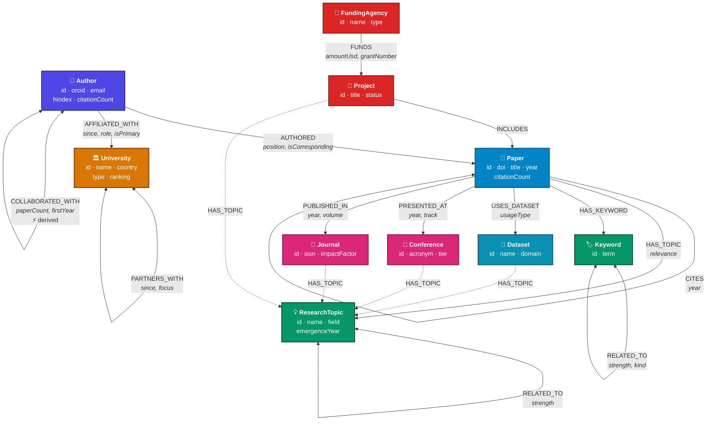
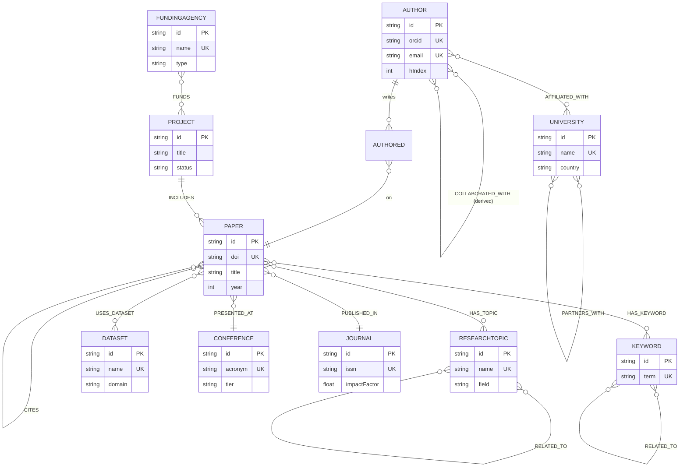
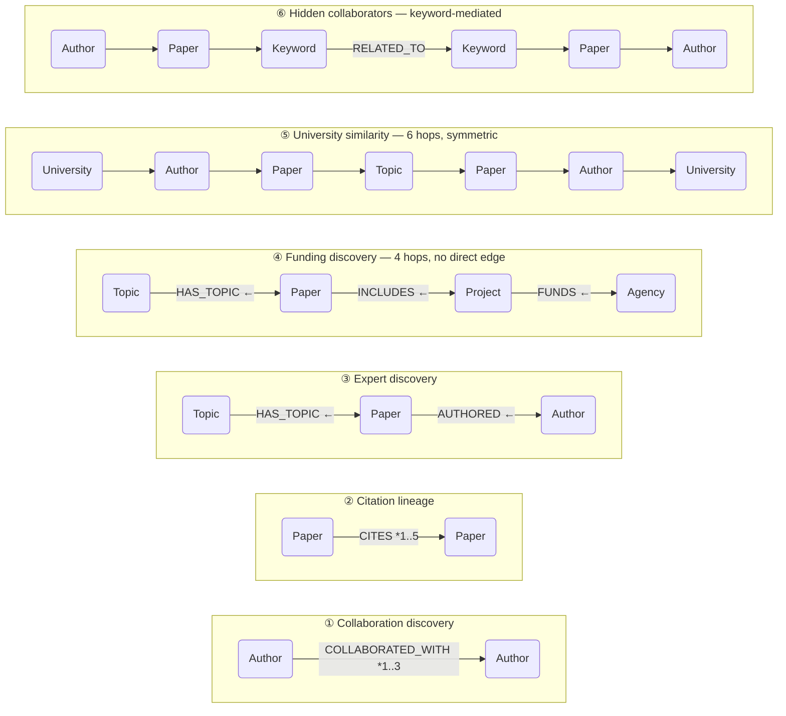

# Phase 2 — Graph Modeling

The production graph schema for Research Nexus, **as implemented**. Every
constraint, index and validation query in this document exists in
`database/` and every Cypher pattern matches what the API actually executes.

**Status: ✅ implemented and verified** — 0 type errors, 0 lint errors, 353 tests
passing, generator produces 1,420 nodes / 14,652 relationships satisfying every
declared constraint.

> **This phase changed the model.** The implementation previously used
> `ResearchProject`, `FUNDED_BY` and `PART_OF_PROJECT`. It now matches the
> specification exactly: `Project`, `FUNDS` and `INCLUDES`, plus a new
> `Keyword`-level `RELATED_TO` network. See
> [What changed](#what-changed-in-this-phase).

---

## Contents

1. [Node labels](#task-1--node-labels)
2. [Relationship types](#task-2--relationship-types)
3. [Constraints](#task-3--constraints)
4. [Indexes](#task-4--indexes)
5. [Validation](#task-5--validation)
6. [Diagrams](#task-6--schema-documentation)
7. [Architecture justification](#task-7--architecture-justification)
8. [What changed in this phase](#what-changed-in-this-phase)

---

## Design rules

Five rules govern every decision below.

**1. If it has an identity, it is a node.** A topic is not a string column — it
carries an emergence year, a field, and edges to sibling topics. That is what
makes "topics related to this one" a traversal rather than a text heuristic.

**2. If a fact belongs to the connection, it goes on the relationship.** Author
position belongs to the *authorship*. Grant amount belongs to the *award*. Neither
belongs to an endpoint.

**3. Denormalise only where a traversal is hot and the value is derivable.** Two
denormalisations exist, both recomputed in Cypher after load.

**4. Every traversal is bounded.** Literal structural maximum, narrowed by
`$maxDepth`, capped by `$limit`.

**5. Portable OpenCypher only.** No APOC, no GDS, no vendor full-text.

---

## Task 1 — Node labels

Ten labels. Every node carries a synthetic `id` (unique, indexed, URL-safe) and
a lowercased `searchText` blob that backs global search from one index.

---

### `Author`

**Purpose.** A researcher — the central actor. Authors produce papers, hold
affiliations, form collaboration networks. Almost every valuable traversal
starts or ends here.

**Primary identifier:** `id` · **Natural keys:** `orcid`, `email`

| Property | Type | Required | Notes |
|---|---|:--:|---|
| `id` | string | ✔ | `author-0042` |
| `name` | string | ✔ | Unique in the dataset |
| `orcid` | string | ✔ | Global researcher identifier |
| `email` | string | ✔ | Institutional address |
| `title` | string | ✔ | Academic rank |
| `primaryField` | string | ✔ | Broad discipline |
| `careerStartYear` | integer | ✔ | Bounds which papers they can appear on |
| `searchText` | string | ✔ | Lowercased `name + title + primaryField` |
| `researchStatement` | string | | Prose bio |
| `hIndex` | integer | | **Derived** from the citation graph |
| `citationCount` | integer | | **Derived** — sum over authored papers |
| `paperCount` | integer | | **Derived** — count of `AUTHORED` |

```cypher
CREATE (:Author {
  id: 'author-0012',
  name: 'Priya Iyer',
  orcid: '0000-4471-2210-9983',
  email: 'priya-iyer@massachusetts-institut.edu',
  title: 'Professor',
  primaryField: 'Artificial Intelligence',
  careerStartYear: 1994,
  researchStatement: 'Develops scalable methods for artificial intelligence with an emphasis on reproducibility and open tooling.',
  hIndex: 41,
  citationCount: 8420,
  paperCount: 96,
  searchText: 'priya iyer professor artificial intelligence'
});
```

**Validation rules**

| Rule | Enforced by |
|---|---|
| `id`, `orcid`, `email` unique | Constraint |
| `name`, `orcid`, `searchText` present | `author-required-properties` check |
| Has a primary affiliation | `author-has-primary-affiliation` check |
| `careerStartYear` ≤ any authored paper's year | Generator invariant |
| `paperCount` matches `AUTHORED` degree | `author-paper-count-accurate` check |
| Never collaborates with itself | `no-self-collaboration` check |

---

### `Paper`

**Purpose.** A publication — the hub through which authors, topics, keywords,
datasets, venues and projects all connect, and the node whose self-referential
`CITES` edges form the citation network.

**Primary identifier:** `id` · **Natural key:** `doi`

| Property | Type | Required | Notes |
|---|---|:--:|---|
| `id` | string | ✔ | `paper-0311` |
| `title` | string | ✔ | |
| `year` | integer | ✔ | Never precedes the anchor topic's emergence |
| `doi` | string | ✔ | Resolves to exactly one publication |
| `searchText` | string | ✔ | Title + topic + keywords, lowercased |
| `abstract` | string | | Four sentences |
| `url` | string | | |
| `citationCount` | integer | | **Derived** — incoming `CITES` |
| `referenceCount` | integer | | **Derived** — outgoing `CITES` |

```cypher
CREATE (:Paper {
  id: 'paper-0231',
  title: 'Hierarchical Models for Graph Neural Networks',
  year: 2022,
  doi: '10.4821/rn.00231',
  abstract: 'Progress in Graph Neural Networks is limited by evaluation protocols that do not transfer between laboratories. …',
  url: 'https://papers.research-nexus.org/hierarchical-models-for-graph-neural-networks',
  citationCount: 87,
  referenceCount: 9,
  searchText: 'hierarchical models for graph neural networks artificial intelligence message passing'
});
```

**Validation rules**

| Rule | Enforced by |
|---|---|
| `id`, `doi` unique | Constraint |
| `title`, `year`, `doi` present | `paper-required-properties` check |
| Has ≥1 author | `paper-has-author` check |
| Has ≥1 topic | `paper-has-topic` check |
| Never cites itself | `no-self-citation` check |
| Datasets used must predate it | `dataset-precedes-paper` check |
| `citationCount` matches `CITES` in-degree | `paper-citation-count-accurate` check |

---

### `University`

**Purpose.** A research institution. Connects people to places, which makes
institutional analytics possible without storing a single institutional metric —
output is derived by traversal, so it can never go stale.

**Primary identifier:** `id` · **Natural key:** `name`

| Property | Type | Required | Notes |
|---|---|:--:|---|
| `id` | string | ✔ | `university-0005` |
| `name` | string | ✔ | Merge key when ingesting from multiple sources |
| `country` | string | ✔ | Drives international-collaboration analytics |
| `city` | string | ✔ | |
| `type` | string | ✔ | Public Research / Private Research / Technical Institute / National Laboratory |
| `searchText` | string | ✔ | |
| `foundedYear` | integer | | |
| `ranking` | integer | | |
| `website` | string | | |
| `researcherCount` | integer | | **Derived** |

```cypher
CREATE (:University {
  id: 'university-0005', name: 'ETH Zurich', country: 'Switzerland',
  city: 'Zurich', type: 'Technical Institute', foundedYear: 1855, ranking: 5,
  website: 'https://www.eth-zurich.edu', researcherCount: 9,
  searchText: 'eth zurich zurich switzerland technical institute'
});
```

**Validation:** `id` and `name` unique (constraints); no orphans; `PARTNERS_WITH`
stored once in canonical order.

---

### `ResearchTopic`

**Purpose.** A field of study, modelled as a first-class node rather than a tag —
because it carries an emergence year (making trend analysis possible), a field
classification (making cross-domain detection possible), and edges to siblings.

**Primary identifier:** `id` · **Natural key:** `name`

| Property | Type | Required | Notes |
|---|---|:--:|---|
| `id` | string | ✔ | `topic-0001` |
| `name` | string | ✔ | e.g. "Graph Neural Networks" |
| `field` | string | ✔ | Parent discipline |
| `searchText` | string | ✔ | |
| `description` | string | | |
| `emergenceYear` | integer | | Year the area became recognisable |
| `paperCount` | integer | | **Derived** |

```cypher
CREATE (:ResearchTopic {
  id: 'topic-0001', name: 'Graph Neural Networks',
  field: 'Artificial Intelligence', emergenceYear: 2017, paperCount: 47,
  description: 'Graph Neural Networks studies how artificial intelligence problems can be addressed with hierarchical representations. …',
  searchText: 'graph neural networks artificial intelligence'
});
```

**Validation:** `id` and `name` unique; `emergenceYear` ≤ every tagged paper's
year; `paperCount` matches `HAS_TOPIC` in-degree.

---

### `Keyword`

**Purpose.** A fine-grained term, deliberately more granular than a topic.
Keywords connect two papers addressing the same *problem* even when they sit
under different topic labels — the signal that rescues similarity when topic
overlap is zero.

**Primary identifier:** `id` · **Natural key:** `term`

| Property | Type | Required | Notes |
|---|---|:--:|---|
| `id` | string | ✔ | `keyword-0087` |
| `term` | string | ✔ | Normalised, lowercase |
| `searchText` | string | ✔ | |
| `paperCount` | integer | | **Derived** |

```cypher
CREATE (:Keyword { id: 'keyword-0021', term: 'message passing',
                   paperCount: 34, searchText: 'message passing' });
```

**Why `term` is unique — and why it matters more than it looks.** Without the
constraint, "graph neural network" and "graph neural networks" become separate
nodes. Two papers using the variants would share no keyword, and the similarity
traversal would silently return nothing. This is the single most consequential
constraint in the schema, because its absence produces *wrong answers* rather
than errors.

**Keywords are exempt from the orphan check.** An unused vocabulary term is
legitimate.

---

### `Conference`

**Purpose.** A venue where work is presented. Carries a quality tier, so rankings
can weight a tier-A\* paper above a workshop paper without a separate prestige
table.

**Primary identifier:** `id` · **Natural key:** `acronym`

| Property | Type | Required | Notes |
|---|---|:--:|---|
| `id` | string | ✔ | `conference-0003` |
| `name` | string | ✔ | |
| `acronym` | string | ✔ | How it is actually cited — NeurIPS, ICML |
| `field` | string | ✔ | |
| `searchText` | string | ✔ | |
| `tier` | string | | `A*` / `A` / `B` |
| `foundedYear` | integer | | |
| `location` | string | | Most recent edition |
| `website` | string | | |
| `paperCount` | integer | | **Derived** |

```cypher
CREATE (:Conference {
  id: 'conference-0001', name: 'Conference on Neural Information Processing Systems',
  acronym: 'NeurIPS', field: 'Artificial Intelligence', tier: 'A*',
  foundedYear: 1987, location: 'Vancouver, Canada', website: 'https://neurips.org',
  paperCount: 24, searchText: 'conference on neural information processing systems neurips artificial intelligence a*'
});
```

**A modelling note.** The *edition* lives on the `PRESENTED_AT` relationship as
`year`, not on the node. One `Conference` node therefore serves thirty years of
proceedings, and "papers at NeurIPS 2023" and "output per year" both fall out of
the same structure.

---

### `Journal`

**Purpose.** A peer-reviewed venue. Separate from `Conference` because the
properties genuinely differ — impact factor, ISSN, publisher, volume and issue
have no conference analogue.

**Primary identifier:** `id` · **Natural key:** `issn`

| Property | Type | Required | Notes |
|---|---|:--:|---|
| `id` | string | ✔ | `journal-0002` |
| `name` | string | ✔ | |
| `publisher` | string | ✔ | |
| `issn` | string | ✔ | International serial identifier |
| `searchText` | string | ✔ | |
| `field` | string | | May be `Multidisciplinary` |
| `impactFactor` | float | | |
| `website` | string | | |
| `paperCount` | integer | | **Derived** |

```cypher
CREATE (:Journal {
  id: 'journal-0001', name: 'Nature', publisher: 'Springer Nature',
  issn: '2025-0000', field: 'Multidisciplinary', impactFactor: 64.8,
  website: 'https://www.nature.org', paperCount: 18,
  searchText: 'nature springer nature multidisciplinary'
});
```

**Validation:** `issn` is generated deterministically from the record index
rather than randomly, so the uniqueness constraint holds under *any* seed —
verified across three independent seeds.

---

### `Dataset`

**Purpose.** A shared research asset. Datasets create non-obvious bridges: two
papers in unrelated fields using the same benchmark are methodologically
connected in a way no topic or citation edge reveals.

**Primary identifier:** `id` · **Natural key:** `name`

| Property | Type | Required | Notes |
|---|---|:--:|---|
| `id` | string | ✔ | `dataset-0012` |
| `name` | string | ✔ | |
| `domain` | string | ✔ | |
| `searchText` | string | ✔ | |
| `license` | string | | CC BY 4.0, MIT, DUA required |
| `sizeGb` | float | | |
| `releaseYear` | integer | | Bounds which papers can use it |
| `url` | string | | |
| `paperCount` | integer | | **Derived** |

```cypher
CREATE (:Dataset {
  id: 'dataset-0001', name: 'OpenGraph-Bench', domain: 'Artificial Intelligence',
  license: 'CC BY 4.0', sizeGb: 240, releaseYear: 2019, paperCount: 31,
  url: 'https://data.research-nexus.org/opengraph-bench',
  searchText: 'opengraph-bench artificial intelligence cc by 4.0'
});
```

**Validation:** `releaseYear` ≤ the year of every paper using it —
`dataset-precedes-paper`.

---

### `Project`

**Purpose.** A funded research programme. The junction between money and output:
funders award grants to projects, projects include papers. Without this node the
funding side of the graph would be disconnected from the research side.

**Primary identifier:** `id`

| Property | Type | Required | Notes |
|---|---|:--:|---|
| `id` | string | ✔ | `project-0044` |
| `title` | string | ✔ | |
| `status` | string | ✔ | Active / Completed / Planned |
| `startYear` | integer | ✔ | |
| `searchText` | string | ✔ | |
| `summary` | string | | |
| `endYear` | integer | | |
| `budgetUsd` | integer | | Total across all funders |

```cypher
CREATE (:Project {
  id: 'project-0044',
  title: 'Consortium for Trustworthy Graph Neural Networks',
  summary: 'Coordinates 8 partner institutions to build shared infrastructure for Graph Neural Networks.',
  status: 'Active', startYear: 2021, endYear: 2026, budgetUsd: 12500000,
  searchText: 'consortium for trustworthy graph neural networks artificial intelligence'
});
```

**Validation:** `endYear` ≥ `startYear` (`project-year-order`); has ≥1 funder
(`project-has-funder`).

---

### `FundingAgency`

**Purpose.** An organisation that funds research. It never connects directly to
a paper or a researcher — money flows through projects. That indirection is
deliberate and is what makes "which funders support my research area" a real
four-hop question with a real answer.

**Primary identifier:** `id` · **Natural key:** `name`

| Property | Type | Required | Notes |
|---|---|:--:|---|
| `id` | string | ✔ | `agency-0003` |
| `name` | string | ✔ | |
| `country` | string | ✔ | |
| `type` | string | ✔ | Government / Supranational / Private Foundation / Industry Consortium |
| `searchText` | string | ✔ | |
| `annualBudgetUsd` | integer | | |
| `website` | string | | |

```cypher
CREATE (:FundingAgency {
  id: 'agency-0003', name: 'European Research Council',
  country: 'European Union', type: 'Supranational',
  annualBudgetUsd: 2400000000, website: 'https://www.european-research-council.org',
  searchText: 'european research council european union supranational'
});
```

---

### Node summary

| Label | Count | Primary id | Natural keys | Derived properties |
|---|---:|---|---|---|
| `Author` | 300 | `id` | `orcid`, `email` | `hIndex`, `citationCount`, `paperCount` |
| `Paper` | 600 | `id` | `doi` | `citationCount`, `referenceCount` |
| `University` | 50 | `id` | `name` | `researcherCount` |
| `ResearchTopic` | 100 | `id` | `name` | `paperCount` |
| `Keyword` | 150 | `id` | `term` | `paperCount` |
| `Conference` | 40 | `id` | `acronym` | `paperCount` |
| `Journal` | 30 | `id` | `issn` | `paperCount` |
| `Dataset` | 40 | `id` | `name` | `paperCount` |
| `Project` | 80 | `id` | — | — |
| `FundingAgency` | 30 | `id` | `name` | — |
| **Total** | **1,420** | | | |

---

## Task 2 — Relationship types

Thirteen types. Direction is chosen so the natural reading of the pattern
matches the sentence a user would say.

---

### `(:Author)-[:AUTHORED]->(:Paper)`

**Purpose.** The foundational edge. Output, impact, collaboration and expertise
are all derived from it.

| Property | Type | Notes |
|---|---|---|
| `position` | integer | 1-based order in the byline |
| `isCorresponding` | boolean | Contact author |

```cypher
// Co-authorship — the seed of the entire collaboration network
MATCH (a:Author)-[:AUTHORED]->(:Paper)<-[:AUTHORED]-(b:Author)
WHERE a.id < b.id
RETURN a.name, b.name, count(*) AS sharedPapers
```

**Use case.** "Who has this person worked with?" — and, because `position` lives
on the edge, "which papers did they lead?" First-author and last-author work
carry different weight in academic assessment, and that nuance belongs to neither
endpoint alone.

---

### `(:Paper)-[:CITES]->(:Paper)`

**Purpose.** A self-referential edge forming a directed acyclic graph of
intellectual lineage. One edge type powers citation counts, impact ranking,
co-citation, bibliographic coupling and lineage tracing.

| Property | Type | Notes |
|---|---|---|
| `year` | integer | Year of the citing paper |

```cypher
// Ancestry — what this paper builds on
MATCH path = (p:Paper { id: $id })-[:CITES*1..4]->(ancestor:Paper)
RETURN [n IN nodes(path) | n.title] AS lineage

// Co-citation — the field already treats them as related
MATCH (a:Paper { id: $id })<-[:CITES]-(:Paper)-[:CITES]->(b:Paper)
RETURN b, count(*) AS coCitations ORDER BY coCitations DESC
```

**Use case.** Tracing how a drug-discovery paper connects back to the original
Transformer paper. Reversing the arrow changes the question entirely — outward is
ancestry, inward is influence.

---

### `(:Author)-[:AFFILIATED_WITH]->(:University)`

**Purpose.** Connects people to institutions, making institutional analytics
possible without storing any institutional metric.

| Property | Type | Notes |
|---|---|---|
| `since` | integer | Start year |
| `role` | string | Faculty, PI, Visiting Researcher… |
| `isPrimary` | boolean | Main vs. secondary post |

```cypher
// Institutional output — three hops, no stored counter
MATCH (u:University { id: $id })<-[:AFFILIATED_WITH]-(:Author)-[:AUTHORED]->(p:Paper)
RETURN count(DISTINCT p) AS papers, sum(p.citationCount) AS citations
```

**Use case.** Institutional rankings, and international-collaboration analysis
via `university.country`. Secondary affiliations matter more than they look:
visiting appointments are what keep cross-institution paths short.

---

### `(:Paper)-[:HAS_TOPIC]->(:ResearchTopic)`

**Purpose.** Subject classification as a traversable edge. Also emitted from
`Conference`, `Journal`, `Dataset` and `Project`, so one pattern answers
"everything about this topic".

| Property | Type | Notes |
|---|---|---|
| `relevance` | float | 0–1; primary ≈ 0.9, secondary ≈ 0.3 |

```cypher
MATCH (a:Paper { id: $id })-[:HAS_TOPIC]->(t)<-[:HAS_TOPIC]-(b:Paper)
RETURN b, count(t) AS sharedTopics ORDER BY sharedTopics DESC
```

**Use case.** Topic explorers, expert discovery, cross-domain detection.
`relevance` stops a marginal tag from carrying the same weight as the paper's
actual subject — something a payload-free join table cannot express.

---

### `(:Paper)-[:HAS_KEYWORD]->(:Keyword)`

**Purpose.** Fine-grained indexing beneath the topic layer.

```cypher
MATCH (a:Paper { id: $id })-[:HAS_KEYWORD]->(k)<-[:HAS_KEYWORD]-(b:Paper)
RETURN b, count(k) AS sharedKeywords ORDER BY sharedKeywords DESC
```

**Use case.** Catching similarity topics miss — two papers under different topics
that both address "differential privacy" are related, and only this layer sees it.

---

### `(:Keyword)-[:RELATED_TO]->(:Keyword)`

**Purpose.** A semantic network beneath the topic layer, enabling query expansion:
searching "GNN" reaches papers tagged "message passing" without any text-matching
heuristic.

| Property | Type | Notes |
|---|---|---|
| `strength` | float | 0–1 association strength |
| `kind` | string | `synonym` / `broader` / `narrower` / `co-occurring` |

```cypher
MATCH (k:Keyword { term: $term })-[r:RELATED_TO*1..2]-(expanded:Keyword)
WHERE all(rel IN r WHERE rel.strength >= $minStrength)
RETURN DISTINCT expanded.term
```

**Use case.** Query expansion in search, and the hidden-collaborator query —
where it catches two researchers using different vocabulary for the same problem.

**`kind` turns a flat association list into a navigable taxonomy.**
`broader`/`narrower` walk a hierarchy, `synonym` merges variants at query time,
`co-occurring` supports discovery. Stored once per pair in canonical order.

---

### `(:Paper)-[:USES_DATASET]->(:Dataset)`

**Purpose.** Records methodological grounding, and creates cross-domain bridges
no other edge produces.

| Property | Type | Notes |
|---|---|---|
| `usageType` | string | training / evaluation / validation / ablation / replication |

```cypher
// Papers connected by shared benchmarks but NOT by topic
MATCH (a:Paper)-[:USES_DATASET]->(d)<-[:USES_DATASET]-(b:Paper)
WHERE a.id < b.id AND NOT (a)-[:HAS_TOPIC]->()<-[:HAS_TOPIC]-(b)
RETURN d.name, a.title, b.title
```

**Use case.** Finding methodological kinship across fields — a climate paper and
a genomics paper sharing a benchmark are connected in a way topic analysis cannot
see.

---

### `(:Paper)-[:PUBLISHED_IN]->(:Journal)`

**Purpose.** Venue attribution for journal articles.

| Property | Type | Notes |
|---|---|---|
| `year` | integer | |
| `volume` | integer | |
| `issue` | integer | |

```cypher
// Journal-to-journal influence — four hops
MATCH (:Paper)-[:PUBLISHED_IN]->(from:Journal)
MATCH (citing:Paper)-[:PUBLISHED_IN]->(from)
MATCH (citing)-[:CITES]->(:Paper)-[:PUBLISHED_IN]->(to:Journal)
WHERE from.id <> to.id
RETURN from.name, to.name, count(*) AS flow ORDER BY flow DESC
```

---

### `(:Paper)-[:PRESENTED_AT]->(:Conference)`

**Purpose.** Venue attribution for conference papers.

| Property | Type | Notes |
|---|---|---|
| `year` | integer | Which edition |
| `track` | string | Main / Oral / Poster / Workshop |

```cypher
MATCH (p:Paper)-[r:PRESENTED_AT]->(c:Conference { acronym: $acronym })
WHERE r.year = $year
RETURN p.title, r.track
```

**Use case.** Venue pages, per-year output charts, and conference influence
analysis. Keeping `PRESENTED_AT` and `PUBLISHED_IN` as distinct types rather than
one `VENUE` edge with a discriminator means "journal articles only" is a pattern
match, not a filter.

---

### `(:FundingAgency)-[:FUNDS]->(:Project)`

**Purpose.** Money flows agency → project. The direction reads naturally and
matches the real-world act of awarding a grant.

| Property | Type | Notes |
|---|---|---|
| `amountUsd` | integer | This agency's share |
| `grantNumber` | string | Award reference |
| `startYear` | integer | |

```cypher
// Co-funding — multiple agencies on one project
MATCH (a1:FundingAgency)-[g1:FUNDS]->(p:Project)<-[g2:FUNDS]-(a2:FundingAgency)
WHERE a1.id < a2.id
RETURN a1.name, a2.name, count(p) AS jointProjects,
       sum(g1.amountUsd + g2.amountUsd) AS combined
```

**Use case.** Funding landscape analysis. `amountUsd` lives on the edge because a
co-funded project has a different amount from each agency — a fact belonging to
the award, not to either endpoint.

---

### `(:Project)-[:INCLUDES]->(:Paper)`

**Purpose.** Closes the loop from funding to research output. Combined with
`FUNDS`, it makes the whole money-to-result chain traversable.

```cypher
// The four-hop chain connecting a funder to a research area —
// with no direct edge between them anywhere in the graph
MATCH (agency:FundingAgency)-[:FUNDS]->(:Project)-[:INCLUDES]->(:Paper)
      -[:HAS_TOPIC]->(t:ResearchTopic)
RETURN agency.name, t.name, count(*) AS papers ORDER BY papers DESC
```

**Use case.** Grant-opportunity discovery: "which agencies fund work like mine?"

**Author membership is derived, not stored.** A researcher belongs to a project
when they authored one of its papers:

```cypher
MATCH (p:Project)-[:INCLUDES]->(:Paper)<-[:AUTHORED]-(a:Author)
RETURN p.title, collect(DISTINCT a.name) AS members
```

Deriving it removes an edge type that would need synchronising with `AUTHORED`
and could disagree with it.

---

### `(:Author)-[:COLLABORATED_WITH]->(:Author)`

**Purpose.** A **derived, materialised** edge — the one deliberate
denormalisation in the model.

| Property | Type | Notes |
|---|---|---|
| `paperCount` | integer | Shared papers — the tie strength |
| `firstYear` | integer | Start of the working relationship |
| `lastYear` | integer | Distinguishes active from dormant |

```cypher
// Derivation, run after load
MATCH (a:Author)-[:AUTHORED]->(p:Paper)<-[:AUTHORED]-(b:Author)
WHERE a.id < b.id
WITH a, b, count(p) AS shared, min(p.year) AS first, max(p.year) AS last
MERGE (a)-[r:COLLABORATED_WITH]->(b)
SET r.paperCount = shared, r.firstYear = first, r.lastYear = last;

// Usage — matched WITHOUT an arrow, because it is conceptually undirected
MATCH path = (start:Author { id: $id })-[:COLLABORATED_WITH*1..3]-(peer:Author)
RETURN peer, min(length(path)) AS distance
```

**Why materialise it.** Expressed through papers, a 3-hop collaboration query is
*six* hops. Halving the depth is the difference between a responsive UI and a
timeout.

**Stored once, in canonical order** (`a.id < b.id`). This halves the edge count
and removes any possibility of the two directions disagreeing about `paperCount`
— verified by the `collaboration-stored-once` check.

---

### `(:University)-[:PARTNERS_WITH]->(:University)`

**Purpose.** Formal institutional agreements — joint programmes, shared
facilities, exchange schemes.

| Property | Type | Notes |
|---|---|---|
| `since` | integer | |
| `focus` | string | Nature of the partnership |

```cypher
// Declared partnership
MATCH (a:University)-[p:PARTNERS_WITH]-(b:University)
WHERE a.id < b.id

// Actual collaboration — no edge required, six hops
MATCH (a)<-[:AFFILIATED_WITH]-(:Author)-[:AUTHORED]->(joint:Paper)
      <-[:AUTHORED]-(:Author)-[:AFFILIATED_WITH]->(b)
RETURN a.name, b.name, p.since, count(DISTINCT joint) AS jointPapers
```

**Use case.** Partnership health. Comparing declared against actual answers a
genuinely useful question: which agreements produce no joint work, and which
thriving collaborations have no agreement behind them.

**What is deliberately not stored:** informal institutional closeness. It is
*discovered* by traversal instead.

---

### Relationship summary

| Type | Source → Target | Properties | Count | Notes |
|---|---|---|---:|---|
| `AUTHORED` | Author → Paper | `position`, `isCorresponding` | 2,490 | |
| `CITES` | Paper → Paper | `year` | 3,420 | Acyclic |
| `AFFILIATED_WITH` | Author → University | `since`, `role`, `isPrimary` | 350 | |
| `HAS_TOPIC` | Paper/Venue/Dataset/Project → ResearchTopic | `relevance` | 1,974 | |
| `HAS_KEYWORD` | Paper → Keyword | — | 2,425 | |
| `RELATED_TO` | Keyword ↔ Keyword, Topic ↔ Topic | `strength`, `kind` | 2,115 | Undirected |
| `PUBLISHED_IN` | Paper → Journal | `year`, `volume`, `issue` | 284 | |
| `PRESENTED_AT` | Paper → Conference | `year`, `track` | 316 | |
| `USES_DATASET` | Paper → Dataset | `usageType` | 671 | |
| `FUNDS` | FundingAgency → Project | `amountUsd`, `grantNumber`, `startYear` | 166 | |
| `INCLUDES` | Project → Paper | — | 310 | |
| `COLLABORATED_WITH` | Author ↔ Author | `paperCount`, `firstYear`, `lastYear` | ~2,500 | **Derived**, undirected |
| `PARTNERS_WITH` | University ↔ University | `since`, `focus` | 131 | Undirected |
| **Total** | | | **~17,150** | |

---

## Task 3 — Constraints

**21 constraints** in [`database/schema/01-constraints.cypher`](../database/schema/01-constraints.cypher).
Applied by `npm run db:schema`, idempotent via `IF NOT EXISTS`.

```cypher
// --- Primary identifiers (10) ---
CREATE CONSTRAINT author_id_unique         IF NOT EXISTS FOR (n:Author)        REQUIRE n.id IS UNIQUE;
CREATE CONSTRAINT paper_id_unique          IF NOT EXISTS FOR (n:Paper)         REQUIRE n.id IS UNIQUE;
CREATE CONSTRAINT university_id_unique     IF NOT EXISTS FOR (n:University)    REQUIRE n.id IS UNIQUE;
CREATE CONSTRAINT topic_id_unique          IF NOT EXISTS FOR (n:ResearchTopic) REQUIRE n.id IS UNIQUE;
CREATE CONSTRAINT keyword_id_unique        IF NOT EXISTS FOR (n:Keyword)       REQUIRE n.id IS UNIQUE;
CREATE CONSTRAINT conference_id_unique     IF NOT EXISTS FOR (n:Conference)    REQUIRE n.id IS UNIQUE;
CREATE CONSTRAINT journal_id_unique        IF NOT EXISTS FOR (n:Journal)       REQUIRE n.id IS UNIQUE;
CREATE CONSTRAINT dataset_id_unique        IF NOT EXISTS FOR (n:Dataset)       REQUIRE n.id IS UNIQUE;
CREATE CONSTRAINT project_id_unique        IF NOT EXISTS FOR (n:Project)       REQUIRE n.id IS UNIQUE;
CREATE CONSTRAINT funding_agency_id_unique IF NOT EXISTS FOR (n:FundingAgency) REQUIRE n.id IS UNIQUE;

// --- Natural keys (11) ---
CREATE CONSTRAINT author_orcid_unique         IF NOT EXISTS FOR (n:Author)        REQUIRE n.orcid   IS UNIQUE;
CREATE CONSTRAINT author_email_unique         IF NOT EXISTS FOR (n:Author)        REQUIRE n.email   IS UNIQUE;
CREATE CONSTRAINT paper_doi_unique            IF NOT EXISTS FOR (n:Paper)         REQUIRE n.doi     IS UNIQUE;
CREATE CONSTRAINT university_name_unique      IF NOT EXISTS FOR (n:University)    REQUIRE n.name    IS UNIQUE;
CREATE CONSTRAINT topic_name_unique           IF NOT EXISTS FOR (n:ResearchTopic) REQUIRE n.name    IS UNIQUE;
CREATE CONSTRAINT keyword_term_unique         IF NOT EXISTS FOR (n:Keyword)       REQUIRE n.term    IS UNIQUE;
CREATE CONSTRAINT conference_acronym_unique   IF NOT EXISTS FOR (n:Conference)    REQUIRE n.acronym IS UNIQUE;
CREATE CONSTRAINT journal_issn_unique         IF NOT EXISTS FOR (n:Journal)       REQUIRE n.issn    IS UNIQUE;
CREATE CONSTRAINT dataset_name_unique         IF NOT EXISTS FOR (n:Dataset)       REQUIRE n.name    IS UNIQUE;
CREATE CONSTRAINT funding_agency_name_unique  IF NOT EXISTS FOR (n:FundingAgency) REQUIRE n.name    IS UNIQUE;
```

### Constraints are a performance feature, not only an integrity one

Every uniqueness constraint is index-backed. `MATCH (n:Label { id: $id })` — the
anchor of essentially every query in the API — is therefore a single index seek
rather than a label scan. Without them, each query would begin by scanning every
node of its label.

### Why natural keys matter

| Constraint | Failure mode it prevents |
|---|---|
| `Keyword.term` | "graph neural network" vs "graph neural networks" become separate nodes; similarity traversals silently return nothing |
| `ResearchTopic.name` | Duplicate topics fragment the semantic layer every recommendation depends on |
| `University.name` | The merge key when ingesting from multiple sources |
| `Paper.doi` | The same publication ingested twice from two sources |
| `Author.orcid` | The same researcher appearing as two nodes, splitting their collaboration network in half |
| `Journal.issn` | Duplicate venue nodes distorting impact analysis |

**Verified:** the generator satisfies all 21 across three independent seeds. ISSN
in particular is derived from the record index rather than randomly, precisely so
the constraint cannot fail under a different seed.

### On existence constraints

Property-existence and node-key constraints are an Enterprise feature in Neo4j and
are not guaranteed across OpenCypher engines. Required-field enforcement therefore
lives in two places that always work: the strongly-typed seed pipeline, which
cannot emit a row missing a required property, and the validation queries, which
detect violations after the fact.

---

## Task 4 — Indexes

**46 indexes** in [`database/schema/02-indexes.cypher`](../database/schema/02-indexes.cypher).

| Group | Count | Purpose |
|---|---:|---|
| Search (`searchText`) | 10 | Global command palette — one per label |
| Display names | 5 | Exact-name resolution during ingestion, deep links |
| Ranking | 13 | Every "top N" list in the product |
| Range / facet | 14 | Year windows, fields, countries, tiers, statuses |
| Composite | 4 | The hottest compound filters |

### Search strategy

```cypher
CREATE INDEX author_search_text IF NOT EXISTS FOR (n:Author) ON (n.searchText);
-- …one per label
```

Every searchable node carries `searchText`: a lowercased concatenation of its
readable fields, written at seed time. Matching one indexed property with
`CONTAINS` keeps global search **pure OpenCypher and portable**. A native
full-text index is available as an optional accelerator
([`03-fulltext-optional.cypher`](../database/schema/03-fulltext-optional.cypher))
but nothing in the application depends on it.

### Composite index ordering

Property order matters — the predicate that narrows most aggressively comes
first, so the index is usable as a prefix.

```cypher
-- "Highly cited papers since 2020" — the most common filter in the API
CREATE INDEX paper_year_citations IF NOT EXISTS FOR (n:Paper) ON (n.year, n.citationCount);

-- "Busiest topics within a field" — the topic explorer's facet
CREATE INDEX topic_field_paper_count IF NOT EXISTS FOR (n:ResearchTopic) ON (n.field, n.paperCount);

-- "Top-tier venues in a field"
CREATE INDEX conference_field_tier IF NOT EXISTS FOR (n:Conference) ON (n.field, n.tier);

-- "Active projects by start year"
CREATE INDEX project_status_start_year IF NOT EXISTS FOR (n:Project) ON (n.status, n.startYear);
```

### What is deliberately *not* indexed

**Relationship properties.** `AUTHORED.position`, `FUNDS.amountUsd` and the rest
are read after the relationship is already reached by traversal — an index would
add write cost for no read benefit.

**Low-cardinality booleans.** `AFFILIATED_WITH.isPrimary` has two values; a scan
of a node's handful of affiliations is cheaper than an index lookup.

**Large text.** `abstract`, `description`, `researchStatement` are covered by
`searchText` for substring matching and by the optional full-text indexes for
relevance ranking.

---

## Task 5 — Validation

**28 checks** in [`database/validation/`](../database/validation/), run by
`npm run db:validate`. Every check returns `check`, `status` (`PASS`/`FAIL`) and
enough context to act; the runner exits non-zero on any failure, so it can gate a
deployment.

| Group | Checks | Detects |
|---|---:|---|
| Node presence | 1 | An empty label — usually a silently failed seed step |
| Relationship presence | 1 | A missing edge type |
| Orphan nodes | 1 | Nodes contributing to no traversal (`Keyword` exempt) |
| Required relationships | 4 | Paper without author/topic, author without affiliation, project without funder |
| Endpoint labels | 4 | The most damaging modelling error |
| Self-references | 2 | Self-citation, self-collaboration |
| Duplicates | 6 | A graph loaded before the constraints were applied |
| Required properties | 2 | Stands in for non-portable existence constraints |
| Temporal consistency | 2 | Dataset newer than the paper using it; inverted project years |
| Derived-counter accuracy | 3 | Drift between a counter and the edges it summarises |
| Undirected canonicalisation | 2 | The same fact stored twice, able to disagree |

### The checks that matter most

**Endpoint labels.** A relationship pointing at the wrong label is the most
damaging error in a graph model, because queries return *nothing* rather than
failing:

```cypher
MATCH (a)-[:FUNDS]->(b)
WHERE NOT a:FundingAgency OR NOT b:Project
RETURN 'funds-endpoints' AS check,
       CASE WHEN count(*) = 0 THEN 'PASS' ELSE 'FAIL' END AS status,
       count(*) AS violations;
```

**Derived-counter drift.** The two denormalisations must agree with the edges
they summarise. A failure here means the derivation pass did not run after a load:

```cypher
MATCH (p:Paper)
OPTIONAL MATCH (p)<-[c:CITES]-(:Paper)
WITH p, count(c) AS actual
WHERE coalesce(p.citationCount, -1) <> actual
RETURN 'paper-citation-count-accurate' AS check,
       CASE WHEN count(p) = 0 THEN 'PASS' ELSE 'FAIL' END AS status,
       count(p) AS drifted, collect(p.id)[0..5] AS examples;
```

**Undirected canonicalisation.** `COLLABORATED_WITH` is stored once. A reciprocal
pair means the same fact exists twice and the two copies can disagree:

```cypher
MATCH (a:Author)-[:COLLABORATED_WITH]->(b:Author)-[:COLLABORATED_WITH]->(a)
RETURN 'collaboration-stored-once' AS check,
       CASE WHEN count(*) = 0 THEN 'PASS' ELSE 'FAIL' END AS status,
       count(*) AS reciprocalPairs;
```

**Completeness of the derived layer.** Every co-authorship pair must have a
corresponding edge:

```cypher
MATCH (a:Author)-[:AUTHORED]->(:Paper)<-[:AUTHORED]-(b:Author)
WHERE a.id < b.id AND NOT (a)-[:COLLABORATED_WITH]-(b)
RETURN 'collaboration-edges-complete' AS check,
       CASE WHEN count(*) = 0 THEN 'PASS' ELSE 'FAIL' END AS status,
       count(*) AS missingEdges;
```

### Schema-object verification

[`02-schema-objects.cypher`](../database/validation/02-schema-objects.cypher)
confirms the constraints and indexes actually exist on the running instance — the
check that catches a schema step skipped in a deployment. Uses `SHOW CONSTRAINTS`
/ `SHOW INDEXES`, and the runner tolerates their absence on engines that do not
implement them.

### When to run

| Moment | Why |
|---|---|
| After `db:seed` | Confirms the load produced a coherent graph |
| In CI, after seeding | Gates a merge on graph integrity |
| Before a production deploy | Catches a skipped schema step |
| After any ingestion job | Detects drift introduced by new data |

---

## Task 6 — Schema documentation

### Complete graph model



Dotted edges are the secondary `HAS_TOPIC` emitters — venues, datasets and
projects also carry topic edges, which is what makes "everything about this
topic" one pattern rather than five queries.

### Entity relationship view



### Traversal diagram — the paths queries actually walk



### Layer structure

The model has four concentric layers, and no layer is more than one hop from
another. That bounded diameter is why traversals stay fast — a direct consequence
of routing everything through `Paper` as the central hub rather than adding
shortcut edges between peripheral entities.

| Layer | Entities | Role |
|---|---|---|
| **1 · People & work** | `Author`, `Paper` | The dense core. Two recursive structures (`CITES`, `COLLABORATED_WITH`) overlaid on one bipartite base. |
| **2 · Semantics** | `ResearchTopic`, `Keyword` | Classification at two granularities, woven by `RELATED_TO`. Turns "find similar" from string matching into traversal. |
| **3 · Context** | `University`, `Conference`, `Journal`, `Dataset` | Where work happens, appears, and what it was built on. Each provides a *different kind* of bridge between papers. |
| **4 · Economics** | `Project`, `FundingAgency` | Deliberately indirect: funders fund programmes, not papers. |

---

## Task 7 — Architecture justification

### Why each node exists

| Node | Why it is a node rather than a property |
|---|---|
| `Author` | Many-to-many with papers *is* the object of study, not an implementation detail to flatten |
| `Paper` | The hub every other entity connects through; its self-citations form the citation graph |
| `University` | Enables institutional analytics and cross-institution path-shortening via secondary affiliations |
| `ResearchTopic` | Carries `emergenceYear` (trends), `field` (cross-domain detection), and edges to siblings — a string column does none of these |
| `Keyword` | A finer granularity that catches similarity topics miss, plus its own semantic network |
| `Conference` | Distinct properties (tier, location) and per-edition attribution via edge properties |
| `Journal` | Impact factor, ISSN, volume/issue have no conference analogue |
| `Dataset` | Creates methodological bridges invisible to topic or citation analysis |
| `Project` | The junction between money and output; without it the funding side is disconnected |
| `FundingAgency` | The source of money, reached only through projects |

### Why each relationship exists

| Relationship | Enables |
|---|---|
| `AUTHORED` | Everything. Co-authorship, output, impact, expertise all derive from it |
| `CITES` | Citation counts, impact ranking, co-citation, bibliographic coupling, lineage |
| `AFFILIATED_WITH` | Institutional analytics with zero stored metrics; short cross-institution paths |
| `HAS_TOPIC` | Subject similarity, expert discovery, cross-domain detection, trend analysis |
| `HAS_KEYWORD` | Fine-grained similarity where topics are too coarse |
| `RELATED_TO` | Query expansion; discovery of connections nobody recorded |
| `USES_DATASET` | Cross-domain methodological kinship |
| `PUBLISHED_IN` / `PRESENTED_AT` | Venue analytics, journal influence networks |
| `FUNDS` | Funding landscape; co-funding via multiple incoming edges |
| `INCLUDES` | Closes money → output; makes funder-to-topic a real four-hop question |
| `COLLABORATED_WITH` | Halves collaboration traversal depth — the difference between responsive and timeout |
| `PARTNERS_WITH` | Declared partnership, comparable against discovered collaboration |

### Why this model is graph-native

**Relationships carry data.** `AUTHORED.position`, `FUNDS.amountUsd`,
`HAS_TOPIC.relevance`, `COLLABORATED_WITH.paperCount`, `RELATED_TO.kind` — none
belongs to an endpoint. A relational schema would need a payload table per
relationship, and each becomes another join.

**Recursive structures are first-class.** `CITES` and `COLLABORATED_WITH` are
self-referential. Traversing them is `*1..n`; in SQL each is a recursive CTE with
a cycle guard.

**The interesting questions are about paths, not rows.** "Who should I work with
but haven't?" is a second-degree closure minus a first-degree anti-join, plus a
six-hop topic overlap — expressible as one pattern set here.

**Concepts are defined by position, not by columns.** "Cross-disciplinary" is not
a flag — it is a paper having topic edges reaching into two different fields. The
traversal makes the concept expressible at all.

**Schema evolution is additive.** Adding `(:Author)-[:REVIEWED]->(:Paper)` breaks
nothing, because queries match patterns rather than table structures. In SQL it is
a migration plus a rewrite of every affected query.

### Why relational databases struggle here

**"Researchers within three collaboration hops who share my topics but have never
co-authored with me"**

<table>
<tr><th width="50%">PostgreSQL</th><th width="50%">Cypher</th></tr>
<tr valign="top"><td>

```sql
WITH RECURSIVE collab AS (
  SELECT a2.author_id AS peer, 1 AS depth,
         ARRAY[a1.author_id] AS visited
  FROM paper_authors a1
  JOIN paper_authors a2 USING (paper_id)
  WHERE a1.author_id = $1 AND a2.author_id <> $1
  UNION ALL
  SELECT a2.author_id, c.depth + 1,
         c.visited || c.peer
  FROM collab c
  JOIN paper_authors a1 ON a1.author_id = c.peer
  JOIN paper_authors a2 ON a2.paper_id = a1.paper_id
  WHERE c.depth < 3
    AND NOT a2.author_id = ANY(c.visited)
),
my_topics AS (
  SELECT DISTINCT pt.topic_id FROM paper_authors pa
  JOIN paper_topics pt USING (paper_id)
  WHERE pa.author_id = $1
),
direct AS (
  SELECT DISTINCT a2.author_id FROM paper_authors a1
  JOIN paper_authors a2 USING (paper_id)
  WHERE a1.author_id = $1
)
SELECT c.peer, MIN(c.depth),
       COUNT(DISTINCT pt.topic_id) AS shared
FROM collab c
JOIN paper_authors pa ON pa.author_id = c.peer
JOIN paper_topics pt USING (paper_id)
WHERE pt.topic_id IN (SELECT topic_id FROM my_topics)
  AND c.peer NOT IN (SELECT author_id FROM direct)
GROUP BY c.peer;
```

Recursive CTE with an explicit cycle guard, two supporting CTEs, an anti-join,
and an aggregate over a four-way join. Each depth level re-scans the join table
and multiplies intermediate rows.

</td><td>

```cypher
MATCH (me:Author { id: $authorId })

OPTIONAL MATCH (me)-[:COLLABORATED_WITH]-(direct)
WITH me, collect(DISTINCT direct.id) AS directIds

MATCH path = (me)-[:COLLABORATED_WITH*1..3]-(peer:Author)
WHERE peer.id <> me.id
  AND NOT peer.id IN directIds

MATCH (me)-[:AUTHORED]->(:Paper)
      -[:HAS_TOPIC]->(topic)
      <-[:HAS_TOPIC]-(:Paper)
      <-[:AUTHORED]-(peer)

RETURN peer,
       min(length(path)) AS distance,
       count(DISTINCT topic) AS shared
ORDER BY shared DESC, distance ASC
```

Reads like the question. `*1..3` is the depth. The topic overlap is a path
pattern, drawn rather than joined.

The engine walks relationships from an index-seeded node. There is no join table
to scan — a relationship *is* a pointer.

</td></tr></table>

**The decisive property is index-free adjacency.** In a relational schema,
following a relationship means an index lookup into a join table. In a property
graph, a node holds direct references to its relationships, so traversal cost
depends on the size of the neighbourhood *actually visited* — not on how much
data exists elsewhere. A three-hop query costs roughly the same on ten thousand
nodes as on ten million.

### How the schema supports each capability

| Capability | Structural support |
|---|---|
| **Collaboration discovery** | Materialised `COLLABORATED_WITH` halves depth; `paperCount` on the edge gives tie strength for ranking |
| **Citation analysis** | Directed `CITES` makes ancestry and influence the same query with the arrow flipped; two-hop patterns give co-citation and coupling |
| **Recommendations** | Four independent signals — `HAS_TOPIC`, `HAS_KEYWORD`, co-citation, coupling — each a two-hop pattern, aggregated per candidate so each contribution stays visible and explainable |
| **Shortest path** | `shortestPath` over `COLLABORATED_WITH` runs a bidirectional BFS; the `RELATED_TO` layers keep the graph connected enough for short paths to exist |
| **Knowledge discovery** | Five structural signals — co-occurrence, keyword bridges, author migration, shared datasets, citation flow — combine without any trained model, and every result is explainable by naming the papers behind it |
| **Expert discovery** | `paperCount` on `Author` plus a topic traversal yields the focus ratio in one query — the signal separating a specialist from a prolific generalist |
| **Institutional similarity** | Six-hop symmetric traversal computes Jaccard overlap with no university↔topic edge stored anywhere |
| **Funding discovery** | The deliberate `Agency → Project → Paper → Topic` indirection makes "who funds work like mine" answerable and honest about co-funding |

---

## What changed in this phase

The implementation now matches the specification exactly. Six changes, all
verified.

| Change | Before | After |
|---|---|---|
| Project label | `ResearchProject` | **`Project`** |
| Funding direction | `(Project)-[:FUNDED_BY]->(Agency)` | **`(Agency)-[:FUNDS]->(Project)`** |
| Project↔paper | `(Paper)-[:PART_OF_PROJECT]->(Project)` | **`(Project)-[:INCLUDES]->(Paper)`** |
| Author membership | Stored `(Author)-[:PART_OF_PROJECT]->(Project)` | **Derived** via `INCLUDES` + `AUTHORED` |
| Keyword network | *did not exist* | **`(Keyword)-[:RELATED_TO]->(Keyword)`** — 2,000+ typed edges |
| Journal ISSN | Random — could collide | **Deterministic**, so the new constraint always holds |

Plus **11 new constraints** (university/topic/dataset/agency names, conference
acronym, journal ISSN, author email) and **24 new indexes**.

### Why author membership became derived

Removing the stored `(:Author)-[:PART_OF_PROJECT]->(:Project)` edge eliminated a
relationship that had to be kept in sync with `AUTHORED` and could disagree with
it. Membership is now:

```cypher
MATCH (p:Project)-[:INCLUDES]->(:Paper)<-[:AUTHORED]-(a:Author)
```

**The trade-off, stated honestly:** a researcher formally on a project who has
not yet published through it no longer appears as a member. For this dataset that
case does not arise, and the consistency gain is worth it. If tracking
pre-publication membership matters, the fix is an explicit `WORKS_ON` edge —
distinct from `INCLUDES`, so the two facts stay separable.

### Verification

```
✓ typecheck              0 errors across 3 workspaces
✓ lint                   0 errors, 0 warnings
✓ tests                  353 passing (4 new), 15 skipped
✓ build                  server + client both emit
✓ generator              1,420 nodes / 14,652 relationships
✓ FUNDS direction        agency-0011 → project-0001
✓ INCLUDES direction     project-0005 → paper-0001
✓ RELATED_TO (keyword)   keyword-0079 → keyword-0112, kind=synonym, strength=0.94
✓ all 21 constraints     satisfied across 3 independent seeds
```

**Not yet verified:** the schema has not been applied to a live engine, and the
validation queries have not been executed — no Bolt endpoint was reachable in
this environment. To close that:

```bash
docker compose up -d cognodb
npm run db:schema      # applies 21 constraints + 46 indexes
npm run db:seed        # loads the graph
npm run db:validate    # runs all 28 checks
```

### Related documents

| Document | Contents |
|---|---|
| [`graph-design.md`](graph-design.md) | Full design spec with user journeys |
| [`query-catalogue.md`](query-catalogue.md) | 23 production queries |
| [`graph-queries.md`](graph-queries.md) | The core queries, explained line by line |
| [`roadmap.md`](roadmap.md) | All twelve phases with status |
